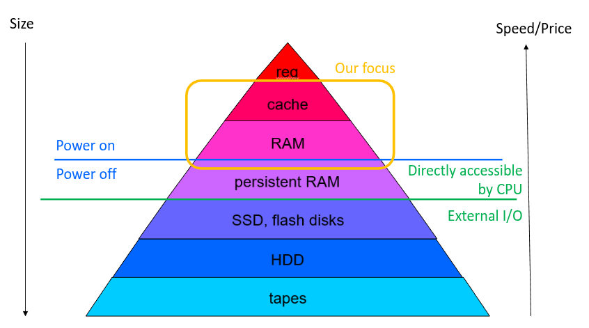
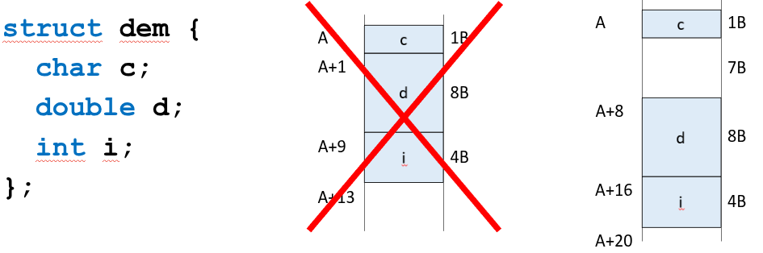
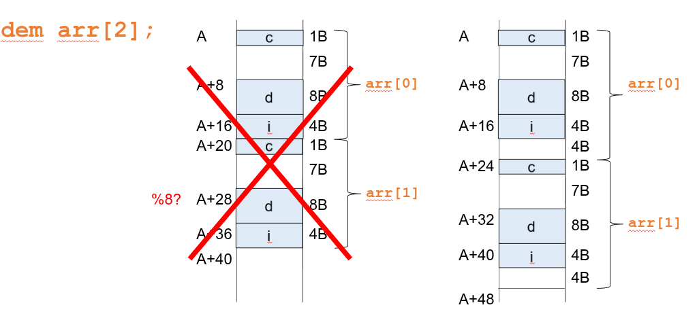

# Memory
## Hierarchie paměti - na pyramidě čím víš, tak tím rychlejší, ale dražší, větší a čím níž tím déle tam vydrží zapsaná data
- cache slouží k vyrovnání rychlosti mezi CPU a pamětí
- power on nahoru - vše co je zde se ztratí po vypnutí
- persistent RAM stejná jako RAM, ale po vypnutí tam zůstanou informace
- zelená čára nahoru - directly accesible (adressable) by CPU
  - pod zelenou čárou - external I/O, musí se na přístup použít řadič

## Definiton
- paměť je organizovaná v paměťových buňkách - bitech
- bity jsou uskupené do slov (slovo je úsek paměti určité velikosti), do paměti se přistupuje po slovech
- dneska 8 bitová slova, (byte) (v RAMkách)
- přístupné adresou, 32 nebo 64 bitové adresy
## Adress space
- adresový prostor je pro CPU prostě array slov
- byty se nepřekrývaj, ale jsou přímo za sebou, není mezi nima mezera

## Fyzický pohled na paměť
- 2D array - row x column
- napřed se paměti řekne která řádka, potom sloupec, toto je uloženo v aderese
- Timing 
  - CAS (tCL) - Column Acces Strobe - počet taktů co tvrá než paměť odpoví na vystavení adresy sloupce, důležitý parametr,
  toto se používá nejčastěji - když se přistupuje sekvenčné, tak se mění toto
## Memory alignment
- CPU potřebujou, aby data v paměti byly uložené na adresa, která je dělitelná velikostí dat (daného datového typu)
  - musí to být zarovnaná jako absolutní adresu
- struktura (adressa, kde je uložená) je zarovnaná na největší datový typ ve struktuře
- ve struktuře se dělá inner padding podle toho, jak jsou velké položky ve struktuře (mezi položkami může být paměť, která se nevyužije)
  - pro položky struktury platí stejná pravidla o uložení na adresu dělitelnou velikostí dat, ale tady je to relativní vůči začátku struktury, ale díky zarovnání struktury to bude ok

- outer padding - na konec struktury se přidá díra, tak aby velikost struktury byl násobek největší datové položky ve struktuře

- takže prvky struktury jsou na adrese takové, že to násobek velikosti prvku a celá struktura musí mít přidaný outer 
padding takový, že zabírá část paměťi, která je násobek velikosti největšího prvku struktury
- sizeof struktury vrací velikost včetně paddingu

## Memory managment
- globální proměnné
  - alokované na začátku, mají fixní pozici v paměti, paměť uvolněná po konci programu
- lokální proměnné, argumenty funkcí
  - alokované na zásobníku stack pointrem
  - na zásobníku jsou i návratové adresy
- Dynamicky alokované proměnné
  - alokované programátorem (`malloc()`, `new`, `free`)
  - alokované at runtime
  - mají dedikovaný paměťový blok pro tyto alokace, musí být opět uvolněné (programátorem nebo garbage collector)
  - jsou alokované on Heap
## Memory allocation
- Task
  - najít dostatečně velký kus paměti z velké části paměti (heap)
- Cyklus dynamicky alokované paměti
  - naalokuj dostatečně velký blok paměti
    - různé strategie, alokátory
  - použij blok
  - uvolni blok
## Fragmentation
- Internal
  - při alokaci paměti pro dynamicky alokovanou proměnnou se naalokuje více paměti než je potřeba (např pro strukturu)
  - naalokuje se tolik, aby to bylo hezké na zarovnání, aby vždy vše na Heapu mělo adresu, která je správný násobek 
(např násobek 16 (nejmenší alokovatelná věc je veliká 16B)), to může způsobit špatné využití paměti
- External
  - když je uvolněná paměť rozdělená do malých bloků, mezi kterými je alokovaná paměť
## Dynamic memmory allocation
- je potřeba souvislej úsek paměti potřebné velikosti
- je potřeba udžovat co je využité
- Free blocks evidence
  - Linked List, na nevyužitém místě je odkaz na další nevyužité místo, stejně tam jsou odkazy na násobky 16, aby bylo vše správně zarovnané
  - Bitmap - je někde uložená

## Alocation algorithms
### first fit
Začíná se od začátku a hledá se první díra kam se požadovaná velikost vejde a upravím bitmapu nebo linked list
- je rychlý a jednoduchý, ale může dělit velké paměťové bloky
### next fit
- stejný jako first fit, ale začíná vždy tam, kde nakonec skončil, pokud dojede nakonec, tak začne od začátku
- next fit a first fit můžou dát malá data do moc velké díry, takže se zaplní zbytečně velké místo kam by se mohlo dát něco velkého
### Best fit
- začíná od začátku, najde nejmenší možnou mezeru
- pomalý, vytváří malinké mezery, ale vynechává velké bloky paměti
### Worst fit
- začne od začátku, najde největší možnou mezeru
- rozděluje velké bloky

## Buddy memory allocation
- paměť se při alokaci dělí do bloků o velikosti $2^N$ pro nějaká N
  - adresy jsou aligned
  - například pokud proces dostal 16kiB dynamické paměti, tak ta se bude dále dělit na poloviny
- vždy se naalokuje blok o velikosti nějaké mocniny $2$
- při alokaci se bloky rozdělují na dvě poloviny do takzvaných buddies
  - když se alokuje, tak se hledá nejmenší blok, do kterého se paměť, kterou alokujeme vejde
    - dále se tento nejmenší blok rozděluje na buddies, dokud se nestane, že by se tam data již nevešly
      - při alokaci pro 64B, nejmenší volný dosud rozdělený blok se najde 256B, ten se rozdělí na 2 buddies o velikosti 
      128B, jeden buddy se vezme (ten s nižší adresou) a dále se rozdělí na dva buddies o velikosti 64B, kteří je již nedělí
  - blok o velikosti $256$ se rozdělí na dva buddies o velikosti $128$
- když uvolníme blok, tak se pokusíme ho sloučit s jeho buddym, pokud je buddy tak volný, slučování se provádí, dokud je to možné
- vytváří velikou interní fragmentaci - pokud alokujeme 513 B, zaplní se 1024B

# Cache
## HW or SW
- ukládání výsledků výpočtů, jejichž výsledky budeme potřebotvat častěji
- Struktura, která ty data udržuje
  - musí být struktura, která má rychlý přístup k datům
  - většinou limitovaná velikost
## Cache in CPU
- překrývá dlouhý přístup k paměti
- když se přistupuje k datům, napřed CPU zjistí jestli data náhodou nejsou v cahce
- procházejí se levely od L1 k L3

## Cache terminology
- cache line/entry
  - caches are usually organized in lines
    - size usually 64B
    - aligned
    - je to vlastně jedna řádka v paměti, naadresuju řádek a pak čtu sekvenčně po sloupcích v jednou řádku
- cache hit
  - jestli jsou data v cache (je to když CPU chce vědět jestli je to v cache a ono to tam je)
  - úspěšnost přibližně $97$%
- cache miss
  - data nebyla v cache nalezená
  - musí se udělat přístup do paměti
  - načtou se data z paměti do cache line
    - buď se načte do prázdné cache line
    - nebo se najde nějaká cache line, která se zapíše do paměti a uvolní se tím cache
    - když se dělá store modifikovaných dat, tak se jiná hodnota napřed zapíše do cache a až ve chvíli, kdy budou tyto
    data vyhozená z cache se nová data zapíšou do paměti
- Cache line state
  - MESI protocol - zkratka 4 stavů cache lines 
    - modified
    - exclusive - 
    - shared
    - invalid - volná cache line

Cache vždy čte a zapisuje do paměti po 64B, musí to tak stejně často být zarovnané v paměti
## Cache implementation
### Associative memory
- hodně rychlá
- je to key value pamět, adresuje se velmi rychle, dotaz je jestli je key v paměti (to se používá adresa 64B bloku v paměti)
  - CPU se ptá jestli 
  - odpověď je buď ano - rovnou vrátí s odpovědí hodnotu k tomuto klíči
  - nebo ne
- velmi drahá
- plně asociativní nebo n-asociativní

Každý přístup do paměti jde přes cahce
# Multiprocesory
- SMP - symetric multiprocessing - více procesorů na stejném system busu (stejném sdíleném), staré, nepoužívá se
- NUMA - non-uniform memory access - více CPU, každý má vlastní paměťový řadič a procesory jsou spojené velmi rychlou sběrnicí
  - CPU mají stejný RAM, ale každý přistupuje do jiného rozsahu
  - pokud CPU potřebuje data v rozsahu jiného CPU musí ho požádat a ten se koukne do cache a potom pošle hodnotu zpět
    - tento přístup je pomalejší - několikrát pomalejší než přístup přímý
    - dá se přístup vylepšovat

