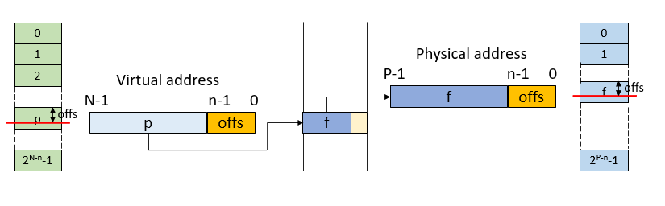

# Operating Systems

## OS Role

- Abstract machine - odstraňuje informace o hardwaru a zátěž spojenou s komunikaci s harwarem,
  - Presented by kernel API - schová hardware před aplikacemi a dá aplikacím jednotný API pro komunikaci s různým
  hardwarem nezávisle na jeho výrobci a verzi
    - System calls
    - Wrapped in C libraries
  - Hide HW complexity/diversity
- Resource manager - spravuje hardwarové zdroje
  - All HW managed by OS
  - Sharing HW among applications
    - Allocation (memory)
    - Time-sharing (CPU) - přidělování výpočetní prostor pro běžící procesy - procesů může být víc než vláken CPU
    - Abstraction (disk, network)

### CPU modes
- User mode
  - Available to all applications
  - Limited (e.g., read-only) or no access to some resources
    - The system registers, instructions - jsou registry a instrukce nedostupné v tomto režimu
- Kernel (system) mode - v tomto režimu běží jádro OS, je snaha aby jádro OS bylo co nejmenší - když v kernelu nastane
chyba, většinou spadne celý počítač, pokud se udělá něco špatného v user modu, kernel jenom zabije daný proces
  - More privileged (all registers and instructions are available)
  - Used by OS or by only part of OS
  - Full access to all resources
- The transition between the modes (especially user -> kernel)
  - Syscall (user instruction), jumps to the explicit kernel entry point
  - přechod do kernell modu není úplně jednoduché (přechody mezi CPU módy trvají dlouho - stojí klidně desítky taktů)
  - přechází se například při otevírání souboru

### Kernel Mode Example


```c
int main() {
    printf("Hello");
    ...
}
movq rdx, @len
movq rcx, @@msg
movq rbx, 1
movq rax, 4
syscall # jumps to adress stored in IA32_LSTAR register and switch ro ring 0 (kernel mode)
...
sysret # return and switch to ring 3
```

## OS Architectures
### Architecture - monolithic
Monolithic systems - vše na stejné vrstvě a všechno může volat všechno
- jeden entry point a pak je tam switch, který vyhodnotí co se má udělat podle toho jakej syscall se zavolal a spustí 
se tak nějaké funkce (service proc)
- Big mess – no structure
- “Early days”
  - Linux
- Collection of procedures
  - Each one can call another one
- No information hiding - všechno je uvnitř jádra a všechno vidí všude, 
  - Potentially error prone
- Efficient use of resources, efficient code
- Originally no extensibility
  - Now able to load modules dynamically (flexible, but even more error-prone)

### Architectue - layered
- evolution of monolithic system
  - Organized into hierarchy of layers
  - Layer n+1 uses exclusively services supported by layer n (kernel je layer 0)
  - Easier to extend and evolve


### Architecture - microkernel
- Microkernel architecture
  - Move as much as possible from the kernel space to the user space
  - Communication between user modules - jádro vlastně jenom zajišťuje komunikaci mezi procesy na uživatelské úrovni,
  takže na uživatelské úrovni jsou i věci tradičně v jádru - otvírání souborů atd
    - Message passing (client/server)
- Extendable, secure, reliable
- May be quite slow - při posílání zpráv se dělá hodně přechodů mezi CPU režimy
- Idea partially adopted in modern systems
- Windows kernel design
- Linux FUSE (Filesystem in Userspace)
interface for custom FS implementations


### trochu mimo
- proč se windows chová tak jak se chová je windows subsystem - ten to zkazí
- jádro Windowsu je kombinace mikrokernelu a monolitického, je to velmi dobré jádro pdobné UNIXu


## Devices
- Terminology
  - Device - “a thing made for a particular purpose”
  - Device controller (řadič), je to kus hardwaru
    - Handles connected devices electrically (signals “on wires”, A/D converters) - zajišťuje připojení věcí a komunikaci s nimi
    - Devices connected in a topology
  - Device driver - ovladač
    - SW component (piece of code), part of OS (module, dynamically loaded)
    - Abstract interface to the upper layer in OS
    - Specific for a controller or a class/group of controllers
    - pro různé zařízení jsou různé drivery a poskytuje API pro vyšší vrstvy
      - byšší vrstvy komunikují s hardwarem přes driver
  - BIOS/UEFI
    - Basic HW interfaces that allow to enumerate and initialize devices on boot
    - onstartup se podívá co kde leží - zařízení a řadiče a načte je do paměti


### Devices topology
- DC - device controller
- BUS - omezené rychlostí sběrnice a je možné komunikovat pouze s jedním zařízením a vyřešit konflikty při vyvolání komunikace od více zařízení
- RING - dneska obsolete, DC má jeden vstupní a jeden výstupní port, pakety se posílají do kruhu
- STAR - řadič a z řadiče vedo každého zařízení dedikovanej kabel - použití např pevné disky
  - ke každému zařízení se přistupuje samostatně - lze komunikovat s více zařízeními najednou
- TREE - například USB


### Device communication
- How CPU performs I/O operations
  - Specialized instructions - zařízení mají namapované adresy - mají vlastní adresový prostor (nesouvisí s pamětí), 
  mapování zajišťuje BIOS/UEFI, lze posílat a číst pouze byty
    - in al, dx
    - out al, dx
  - Memory-mapped devices - jiný způsob než specialized instructions
    - Device operating structures are mapped at fixed addresses (at boot)
    - Basic memory operations are translated by HW into I/O operations - device operating structures mají adresy v 
    adresovém prostoru paměti
      - Reads and writes may trigger some device functions
      - E.g., writing at a specific offset may in fact send a command to the device

### Device handling
1. Application issues an I/O request
2. Language library makes a system call
3. The kernel decides, which device is involved
4. The kernel starts an I/O operation using a device driver
5. The device driver initiates an I/O operation on a device controller
6. Device does something - typicky trvá dlouho - výpočet se může zastavit
7. The device driver checks for the status of the device controller
8. When data are ready, transfer data from the device to the memory
9. Return to any kernel layer and make other I/O operations fulfilling the user request, někdy se musí provést více 
přístupů k zařízení (uživatel to nevidí, o to se staraá kernel), takže se musí vrátit k bodu 4 přibližně
10. Return to the application

### Example PIO disk handling
- to co tam je napsané, postup zapisování do registrů je co dělá controller

### Device intercommunication
- Polling
  - CPU actively checks device status change (like in previous example), dnes se nepoužívá, CPU se dívá do controleru nebo někam a zjišťuje jestli se dokončila operace
- Interrupt
  - The device notifies the CPU that it needs attention
  - CPU interrupts the current execution flow
  - IRQ (interrupt request) handling
  - CPU has at least one pin for requesting an interrupt
  - CPU přeruší daný proces co komunikuje se zařízením a dělá něco jiného
  - CPU nečeká až bude operace dokončena a až jsou data v controleru, tak hardware upozorní CPU, že jsou připravená, CPU
  musí samo přenést do paměti
- DMA (Direct Memory Access) - přešuje se proces
  - Transfer data to/from a device without CPU attention, zařízení samo přenese data do paměti - má k tomu přístup,
  a potom upozorní CPU že to dokončil
  - DMA controller - přenese data z hardwaru přímo do paměti
  - Scatter/gather - data na přenesení do hardwaru můžou být různě po paměti (scatter), DMA controller dostane info, 
  kde je co a on to pozbírá, slepí a pošle to dál
    - například při posílání dat po TCP/IP, kde každá vrstva má svojí hlavičku, tak jak se to encapsuluje, tak to není 
    na jednou místě, ale je to slepeno až na konci

### Interrupt types
- IRQ - interrupt request, signál pro CPU na přerušení výpočtu a přenechání výpočetího prostoru pro interrupt handler
- External - nějaké zařízení přes IRQ řekne CPU, že potřebuje pracovat s CPU, CPU přeruší vykonávání programu a věnuje se HW i guess
  - HW source using an IRQ (interrupt request pin) pin
  - Masking (temporary disabling interrupts) - CPU je schopen ignorovat (dočasně zakázat přerušení), například, 
  když se nějak zapisují data, tak tam mohou být pevné timingy a při tom není moc dobré přerušovat CPU
    - přerušení může zakázat pouze kernel level
- (Hardware) Exception - vyvolává to CPU
  - Unexpectedly triggered by an instruction (when an instruction is executed)
  - Trap (trigger exception after) or fault (instruction rollbacks, trigger before) - 
    - trap vykoná se instrukce a pak CPU hodí přerušení
    - fault - CPU zahodí pipelinu a ani se nepokusí vykonat problémovou instrukci a hodí to OS, který se to pokusí vyřešit - může klidně killnout proces
      - instruction rollback je obnovení stavu CPU před nějakou instrukcí, asi to lze udělat tady, dělá se to u mispredictnutí branchí
  - Predefined set by CPU architecture 
- Software - může ho vyvolat uživatelskej proces
  - Special instruction (e.g., x86 has int)
  - Can be used for the system call mechanism (možnost volání syscallů)
- při přerušení se musí i zahodit pipeline a musí naběhnout znova

### x86 Exceptions
(neučit se)
- x86 Architecture
  - 256 interrupts
  - First 32 reserved for exceptions
  - Remaining are IRQ or SW interrupts

### Interrupt request handling
- What happens, when an interrupt occurs?
  - CPU decides the source of the interrupt
    - Predefined or IRQ controller - podle toho na jaký pin nebo tak něco controlleru přijde interrupt (interrupty jsou očíslované na úrovni OS)
      - řadiče jsou připojené na IRQ controller, pokud nastane výjimka, tak IRQ controller předá tuhle informaci CPU, které si odsud může vytáhnout číslo přerušení
  - CPU gets the address of the interrupt handler - řešeno HW
    - Fixed (defined by ISA)
    - Interrupt table (array of pointers of handlers for individual interrupts) - pro každé číslo přerušení (nebo odkud přerušení přislo) má tabulku s napevno danými adresami, 
  které určují, kde je v paměti program na řešení přerušení (je tam pole, kam se indexuje číslem přerušení - proto jsou čísla přerušení očíslovaná), tahle tabulka je tvořená jádrem OS
  - The current stream of instructions is interrupted, CPU begins execution of interrupt handler’s instructions (přeruší se proud instrukcí, které se právě provádějí - dnes se dokončí instrukce a pak se přeruší tenhle proud, uloží se stav CPU)
    - Usually between instructions (current instruction must be complete or rollback)
    - A privilege switch usually happens, the interrupt handler is part of a kernel (při přerušení výpočtu, aby se pustil interrupt handler se přepne do kernel modu)
    - An essential part of the CPU state (at least IP) must be saved (e.g., to a special register) - stav CPU se někam uloží (například speciální regostr, x86 to pushne na HW stack)
  - The interrupt handler saves the (rest of the) CPU state
  - The Interrupt handler does something useful (its job)
  - The interrupt handler restores the CPU state
  - CPU continues with the original instruction stream

## Processing
- Program
  - A passive set of instruction and data
  - Created by a compiler/linker
  - soubor vytvořenej (zkompilovanej a zlinkovanej)
- Process - spuštěnej program
  - An instance of a program created by OS (puštěnej, vykonává se)
    - program může být puštěnej víckrát (tím vznikne process), pokaždé je to instance stejného programu
  - Program code and data
    - Process address space - process má adresovoej prostor, je kontrolovanej za běhu (adresovej prostor)
  - The program is “enlivened”  by an activity - program je spuštěnej nějakou instrukcí
    - Instructions are executed by CPU
  - Owns other resource - např soubory
  - když je proces zabitej, tak OS musí uvolnit zdroje, které má proces dostupnej - jedna z funkcí OS
  - když se pouští program, spawne se proces a vytvoří se jedno vlákno (hlavní vlákno), které se začne vykonávat ve vstupním bodu programu, tohle vlákno může spawnovat další vlákna
- Thread - zodpovídá za ně OS
  - One activity in a process - jeden process může využít více vláken na CPU, proto je to oddělené (ve zdrojáku lze spawnovat jádra)
  - Stream of instructions executed by CPU
  - každé vlákno má vlastní zásobník, kde je schovanej stav CPU
  - Unit of kernel scheduling - používá se k plánování (mezi vlákny lze přepínat - vytvoří se tak softwarově více vláken)
    - I.e., Holds CPU context
  - při pouštění funkce ve více vláknech má funkce v každém vláknu vlastní aktivační záznam a nevidí na sebe navzájem
- Fiber - zodpovídá za ně např uživatelská knihovna
  - Lighter unit of scheduling - lightweight vlákna, je jednodušší (a rychlejší) mezi němi přepínat
  - Cooperative scheduling
    - Running fiber explicitly yields
  - process může mít několik vláken a ty můžou být rozdělené knihovnou na fibery, které sdílí výpočetní prostředky 
  vláken a střídají se v exekuci - fiber může odmítnout výpočetní čas

### Process vs. Thread
- Process
  - Code (loaded in memory)
  - Memory space
  - Other system resources
    - File handles
    - Network sockets
    - Synchronization primitives
- Thread
  - Position in code (program counter)
  - Own stack (rest is shared) - thready (jednoho procesu) mají sdílený adresový prostor, až na stack
  - Access to some system resources may require synchronization - problémy, přístup do paměti (na jedno místo) více vlákny najednou
  - CPU state
    - Must be saved when thread is removed from CPU core and reloaded when the thread resumes

### Creating a process

### Parent-child process relation
- Linux
  - A child holds its parent’s IDs (ppid)
  - A child notifies the parent by SIGCHILD signal when terminated
  - A terminated process becomes a zombie until asked for an exit code
  - Killing a process does not kill its children
    - Children are orphaned and readopted by the init process (pid 1)
    - Killing an entire processes tree needs special effort
- Windows
  - Slightly more complicated(the win32 process entry does not record ppid, but it is available in NTQuerySystemInformation)
  - No special relationship between child-parent
  - Process manager can kill the whole sub-tree (but it is not a feature of the OS)

### Creating a thread

## Processing
- Scheduler
  - Part of OS
  - Uses scheduling algorithms to assign computing resources to scheduling units (CPU cores)
- Multitasking
  - Concurrent executions of multiple processes, přidělování času na procesoru procesům, tak aby to vypadalo, že běží najednou (na single core systémech)
- Multiprocessing - přidělování času na procesoru na multi core systémech
  - Multiple CPUs (cores) in one system
  - More challenging for the scheduler
  - Affinity - process si může určit, na kterých jádrech má běžet, proces má afinitu k určitým jádrům
- Context - scheduler pracuje s tím, že u vláken jsou kontexty - vlastnš stav CPU při vykonávání vlákna
  - CPU (and possibly other) state of a scheduling unit, v kontextu můžou být tyto informace:
    - Registers (including PC, specialized vector registers), stav registrů
    - Additional units (x87 coprocessor)
    - Virtual memory and address-space-related context
      - Page tables, TLB (will be covered later)
      - Memory caches are transparent (not part of the context, but may affect performance)
- Context switch
  - Process of storing the context of a scheduling unit (when suspended) and restoring the context of another scheduling unit (when resumed)
    - vymění běžící kontext a jiný kontext, data běžícího kontextu se musí uložit do paměti
  - Quite costly (hundreds-thousands of instructions)
  - celkově je kontext switch uložení stavu CPU běžícího kontextu a načíst stav CPU následujícího kontextu
  - kontext switch je celkem náročný

## Real-time scheduling
- Real-time scheduling
  - RT process has a start time (release time - kdy to má začít něco dělat) and a stop time (deadline - do kdy to musí skončit)
  - Release time – the time at which the process must start after some event occurred
  - Deadline – the time by which the task must complete
    - Hard – no value to continuing computation after the deadline, když se nestihne deadline, tak ani nemá smysl snažit se dokončovat real time process
    - Soft – the value of late result diminishes with time after the deadline, když se nestihne, tak má pořád smysl se to snažit dokončit

### Unit of scheduling state (např kontext je jednotka plánování), její stavy i guess
- v obrázku jsou vidět přechody mezi stavy
- Created - čeká na přijmutí, oddělené kvůli real time scheduling
  - Awaits admission
- Terminated - jednotka je dokončená, čeká na odstranění
  - Until the parent process reads the result
- Ready - jednotky ve stavu ready jsou ve frontě a čekají na naplánování
  - Wait for scheduling
- Running
  - CPU assigned
  - jednotka běží
  - je možné jí přenést do ready
- Blocked
  - Wait for resources - například když se čte z disku, tak je jednotka plánování přesunutá do tohohle stavu
    - jednotka je blocked, začne čtení dat, data se přečtou, přijde přerušení od disku a jádro OS přesune do stavu ready
  - lze se sem dostat z running
  - tohle stav např i když je v programu sleep funkce


## Multitasking
- Cooperative
  - Unit of scheduling must explicitly and voluntarily yield control, jednotka se vzdá výpočetního času
  - All processes must cooperate, pokud není, tak to může být problém
    - Special systems - pokud všichni spolupracují dobře, např síťové switche
  - Scheduling in OS reduced on starting the process and making context switch after the yield
  - OS does not initiate a context switch
- Preemptive
  - Each running unit of scheduling has an assigned time slice
  - OS needs some external source of interrupt (HW timer)
  - If the unit of scheduling blocks or is terminated before the time slice ends, nothing of interest happens
  - If the unit of scheduling consumes the whole time slice - 
    - interrupted by the external source - nějaký časovač, nastane přerušení a OS přesune jednotku výpočtu do stavu ready(aby nepočítal moc dlouho)
    - changed to READY state
    - OS will make a context switch

## Scheduling
- Objectives
  - Maximize/optimize CPU utilization (based on the workload) - cílem je využít CPU co nejvíc
  - Fair allocation of CPU - aby každý proces/vlákno nečekalo moc dlouho na výpočet
  - Maximize throughput
    - Number of processes that complete their execution per time unit
  - Minimize turnaround time
    - The amount of time taken by a process to finish
  - Minimize waiting time
    - Time a process waits in the READY state
  - Minimize response time
    - Time to respond in interactive applications
  - Pro interaktivní aplikace (GUI) musí být zajištěno, aby byla co nejmenší odezva po uživatelské interakci, jinak tyto programy hrozně dlouho nic nedělají - to se nějak dělá v Kernelu

### Scheduling – priority
- Priority
  - A number expressing the importance of the process
  - Unit of scheduling with greater priority should be scheduled before (or more often than) unit of scheduling with lower priority
  - The priority of the process is the sum of a static priority and dynamic priority - zajistí, aby jednotky plánování s nízkou prioritou se někdy dostaly k CPU
    - Static priority
      - Assigned at the start of the process
        - Users’ hierarchy or importance
    - Dynamic priority
      - Adding fairness to the scheduling
      - Once in a time, the dynamic priority is increased for all READY units of scheduling
      - The dynamic priority is initialized to 0 and is reset to 0 after the unit of scheduling is scheduled for execution
  - Například systémové jednotky plánování mají velmi vysokou prioritu - aby něco dělali co nejčastěji

### Scheduling algorithms – non-preemptive
- First Come, First Serve (FCFS)
  - Single FIFO queue
  - A process enters the queue on the tail, the head process is running on the CPU
  - Afterward, it is removed from the queue
- Shortest Job First
  - Maximizes throughput
  - Expected job execution time must be known in advance
- Longest Job First

### Scheduling algorithms – preemptive
- Round Robin - někteří učitelé tomu říkají "kruhová sýkorka" nebo nějakej takovej bizár
  - Like FCFS (First come first serve) (but preemptive)
  - Single queue
  - Each unit of scheduling has an assigned time slice
  - If the unit of scheduling consumes the whole time slice or is blocked, it will be assigned to the tail of the queue
- Multilevel feedback-queue
  - Multiple queues (typicky jich bývá 8)
    - Time-slice defined by queue (increasing)
    - nejvyšší fronta má nejvyšší prioritu
    - při plánování vezme unit of scheduling (US) z nejvyšší neprázdné fronty
    - US v nejvyšší frontě mají nejkratší time slice a time slice se zvětšuje zezhora dolů
  - If the unit of scheduling consumes the whole time slice, it will be assigned to the lower queue
  - If the unit of scheduling blocks itself before consuming the whole time slice, it will be assigned to the higher queue
  - Schedule head unit of scheduling from the highest non-empty queue
  - tohle dobře zvládá interaktivní aplikace - něco dělané např v WinForms - tyhle fungují tak, že se s nimi interaguje a aplikace pak vykoná něco rychlého (na výpočetní čas), ale je potřeba aby jejich odezva byla rychlá - budou v nejvyšších frontách
  - při čtení ze souborů aplikace bublaj nahoru - zavolaj syscall čtení a hned se zablokujou, po ukončení čtení budou počítat - takže budou opět bublat dolů
  - nové procesy jsou přiřazené do front podle jejich priority
    - čím větší priorita, tím vyšší fronta


- Completely fair scheduler (CFS) - netriviální, jenom to ukazoval
  - Implemented in Linux kernel
    - Currently the default scheduler
  - SUs are stored in a red-black tree
    - Indexed by their total execution time (called virtual runtime)
    - One tree per CPU core
  - Maximum execution time
    - A time slice calculated for each unit
    - Total waiting time divided by the current number of processes
      - The longer it waits, the greater 
  - Scheduling algorithm
    - The leftmost node in the RB tree is selected (lowest virtual runtime)
    - If the process completes its execution, it is removed from the schedule
    - If the process reaches its maximum execution time or is somehow stopped or interrupted, it is reinserted into the tree with a new time key
      - Actual time spent on the CPU is added to the virtual runtime
  - Virtual runtime decays over time

### Inter-Process Communication
- Cooperating processes
  - OS isolates resources of each process (memory, device handlers, …)
  - IPC (inter-process communication) presents a secure way for data exchange
    - OS-specific APIs
- Typical IPC methods supported by most systems
  - Pipes - na linuxu
    - Or other types of sockets (e.g., TCP over loopback)
  - Shared memory - používaná oraclem v databázích
    - Or shared external memory (files)
  - Signals - taky na linuxu
    - Also used for kernel -> process communication (e.g., when CPU exception occurs)

## File
- File
  - Data organization unit
  - Collection of related information
    - Abstract stream of data (bytes)
      - Kernel does not understand file formats
        - systém rozumí pouze adresářům, adresáře josu pouze speciální typ souborů
    - Typically stored on secondary storage (soubory jsou perzistentní, respektive secondary storage je perzistentní),
    but there are other possibilities (temporary soubory, které leží v paměti - jsou neskutečně rychlé)
- File identification
  - System uses numeric identifiers
  - File name and path – a named reference to the file identifier in organized tree structure
    - So that humans can find the files
    - Some parts of the file name may have special meaning (leading dot, extension)

### File operations
- `open` na soubor vrátí pouze číslo souboru vygenerované OS (není to opravdové číslo souboru - z bezpečnostních důvodů),
číslování souborů pro proces je process unique, proces má tabulku otevřených souborů
- jsou režimy pro otevírání souborů, soubory jako read může mít otevřeno více procesů, ale pouze jeden proces může mít
otevřený soubor pro zápis
  - je více druhů write
    - klasický write zruší všechno co je v souboru a do souboru se zapisuje na začátek a ukazovátko do proudu dat je nastavené do souboru
    - append, připisuje na konec souboru, ukazovátko do proudu dat je na konec souboru
- `seek` - pocess má ukazovátko do proudu bytů (tak soubory interpretuje OS) a seek změní polohu ukazovátka
- `close` - je potřeba zavřít soubor - OS dopíše nějaké nazapsané byty, odebere soubor z tabulky otevřených souborů procesu, 
případně uvolní soubor pro další procesy, pokud byl soubor otevřenej pro zápis
- Additional operations
  - Create, truncate, (nějaké oříznutí souboru) delete, flush, change attributes (atributy jsou např.: čas vytvoření 
  souboru, poslední otevření souboru, práva, jméno souboru)
- File handle - je to číselné označení souboru, které je proces unique
  - Process-specific sequentially assigned, kernel holds translation table
  - sdtin má handle $0$
  - stdout má handle $1$
  - stterr má handle $2$
- Buffering - Buffery jsou v paměti
  - To increase performance, multiple levels (system, language runtime)
  - načítání dat in advance (sequential acces rychlejší) - někam do paměti se uloží data z disku a pak je rychlejší 
  přístup k těmto datům (dávají se k použití, jak si o ně process actually žádá), runtimy jazyků to dělají automaticky
  (načítají například 4 kiB), OS často dělá vlastní buffering (třeba 64kiB) a při syscallu od runtimu jazyka mu to 
  servíruje rychleji a nemusí se dělat přerušení
  - Buffering se dělá i při zápisu - při vypnutí napájení nemusí být vše zapsané na disk
  - Sequential vs random access - sekvenční trochu lepší, oboje se dá vylepšit pokud dělá OS read-ahead (buffering)
- Alternatives
  - Memory mapping (will become more clear after memory management)
  - Async file I/O - pomocí neblokující funkce, která hned vrátí nějaký identifikátor a je kdyspozici funkce pro kontrolu, 
  jestly bylo čtení dokončeno, nemusí se proces blokovat při čtení a počítat něco jiného

### File attributes

### File directory
- Directory
  - Collection (list) of file entries
    - Efficiency – a file can be located more quickly
    - Naming – better navigation for users
    - Grouping – a logical grouping of files
  - Usually represented as a file of a special type
  - May store (some of) the file attributes (depends on fs design – e.g., FAT vs. EXT)
  - Hierarchy or structure
    - Root
  - Operations
    - Create/delete/rename file/subdirectory
    - Search for a name - operace se provádí při `open` souboru, proto je open pomalé
    - List members

#### File directory example
- FAT directory entry
  - File name “The quick brown fox”

### File storage
- Traditional storage
  - File system in secondary or external storage (persisted)
  - File system in RAM (e.g., for temporary files)
- Network storage
  - Protocols for performing FS operations remotely over network
- Virtual (system) files
  - Using file abstraction to provide additional (system) features
```
/dev/null
/dev/urandom
/proc/cpuinfo
```

### File Links
- Links (hard links)
  - Multiple directory entries refer to the same physical file (same file ID)
  - Most operations are transparent (no special handling required)
  - Saves space (in some situations), creates additional problems
    - E.g., file deletion should not always remove the file data (reference counting)
  - hard link je odkaz přímo na data na file systému
- Symlinks (soft links)
  - Special files where text content holds a path to another file
    - Does not refer to file IDs
  - Requires special handling in path processing (“follow symlinks”)
    - Often hidden in basic system tools or programming runtime libraries
  - soft link je odkaz na jiný záznam ve file systému

### FIle System
- disk je rozloženej na partitions, každá může mít jiný file system
- File system
  - How and where data are stored
    - Formats - formát/datová struktura
    - protocols
  - Implementation of an abstraction for files and directories
  - Responsibility
    - Name translation (directory format) - musí umět převádět různé typy názvu souboru na celé jméno a podom na ID asi
    - Data blocks management - paměť je rozdělená do bloků, když zapíšeme soubor na disk, ten soubor bude mít vyhrazený
    minimálně jeden blok (blok minimálně 4 kiB)
      - Allocated vs. free blocks - musí být někde uložené volné bloky
      - Bitmap, linked list, B-tree, …
    - File data management
      - Sequence of data blocks - pro každý soubor musí být v nějaké datové struktuře uloženo, v jakých blocích jsou data uložena

#### Local File system
- Stored on HDD, SSD, removable media
- FAT, NTFS, ext234, XFS, …

#### Network file system
- Protocol for accessing files and directories over the network
- NFS, CIFS/SMB, …

### FIles systems examples
#### FAT 
- File Allocation Table (FAT)
  - Simple, old, MS-DOS, many variants used today
  - One structure (FAT) for managing free blocks and file data location - zvládá jak udžování volných bloků, tak i 
  udžování bloků vyhrazaných pro jednotlivé soubory
  - Boot record - informace o celém file systemu, velikost rootu
  - 2 FAT - jsou identické, je to nějaké jakoby ochrana proti corruption, první se zapisuje do FAT1 a až tam je vše 
  zapsáno, tak se to zapíše i do FAT2
    - FAT je datová struktura, která drží metadata file systému - volné bloky, bloky vzhrazané pro soubory
  - root directory - root má fixní velikost v FAT
  - DATA - tady jsou samotné bloky, první datový blok má číslo 2 (1 je root)
  - Directory (jak vypadá záznam souboru v directory) - tohle je v data části (v adresáři, kde soubor bydlí, adresář je taky soubor)
    - Sequence of entries with fixed size and attributes - každý záznam má fixní velikost
      - Starting cluster (místo, kde začíná soubor v paměti, name+ext, size, timestamps, attributes
        - starting cluster určuje, kde je první blok souboru
    - Root in fixed position
  - Jak vypadá FAT - je to tabulka s číslama, kam se dá indexovat, idnexy začínají od 2 (1 je root)
    - index je číslo bloku, pokud je na indexu daného bloku 0, jedná se o volný blok
      - pokud je na indexu jiné číslo než nula, je tam číslo bloku, které následuje pro daný soubor
        - v záznamu souboru je první blok, pokud číslem prvního bloku souboru zaindexuju do FAT, tak dostanu číslo 
        dalšího bloku a tímto číslem budu opět indexovat do FAT, tohle provádím, dokud nenarazím na $-1$, která určuje,
        že daný blok (ten co má na svém indexu $-1$) je poslední blok
  - FAT je na dnešní PC tak malý, že daná struktura je celá v paměti


#### Ext2
- Second extended file system (ext2)
  - Simple, old, Linux
    - Ext3 – added journal to improve persistence
    - Ext4 – improvement of ext3, larger individual files (16T) and FS (1 EB)
  - File system je na nějakém partitionu a je tvořen těmito částmi
    - boot record - informace o file systému - velikost atd
    - N skupin bloků, skupiny bloků asi nesdílý čísla data bloků (každá skupina má svoje číslování, není to ověřená informace) jedna skupina bloků se dělí následovně:
      - Superblock - udržuje informace o celém filesystému, je stejný v každé block group
      - Descriptor - popisuje jak vypadá block group
      - Data bitmap - bitmapa, popisuje, které bloky jsou zabrané
      - Inode Bitmap - tady je bitmapa, která má záznamy o tom jaké inody jsou alokované a jaké nejsou
      - Inode table - obsahuje jednotlivé inody
      - Data blocks
  - Inode (index node) - způsob záznamu jednoho souboru v daném adresáři (soubor může být jak adresář tak soubor)
    - Represents one file/directory
    - Tree-like hierarchy with block references (faster than linked list)
      - Smaller files are represented more efficiently
    - Holds most of the attributes
    - skládá se z následujících částí
      - Info - informace o souboru - asi přístupová práva a něco dalšího (asi i informace o tom jaké data bloky jsou doopravdy používané), taky timestampy vytvořeí a poslední úpravy
      - $11$ Direct pointerů - přímé pointery na data bloky, ze kterých se skládá soubor
      - $1$ Indirect pointer - ten ukazuje na data blok ve kterém jsou pouze pointery na opravdové data bloky
      - $1$ Double indirect pointer - jako indirect pointer akorát je přidaná jedna vrstva - pointer ukazuje na blok, který obshuje pointery na bloky, které obsahují pointery na opravdové data bloky
      - $1$ Triple indirect pointer - double indirect pointer, akorát má o vrstvu navíc
        - Indirect, Double Indirect a Trible Indirect pointery jsou vlastně úplné stromy (každý z těchto pointerů ukazuje na vrchol stromu), kde v listech jsou opravdové data bloky a vždy přibyde jedna vrstva stromu
          - strom se větví tolik, kolik se do jednoho bloky vejde pointerů
  - Directory
    - Sequence of entries with fixed structure
      - Inode number, file name - directory je jenom seznam záznamů, kde jsou názvy souborů a čísla inode


### Hard Disc mechanics
- Additional terminology
  - Block – the same sector on all platters
  - Cluster – the same track on all platters
  - Flying height – distance between head and platter (~5 nm)
  - Rotational speed – 5400, 7200, 10k, 15k rpm

### Disk scheduling algorithms
- What?
  - Scheduling of I/O requests for the disk
  - Originally done by OS, now by disk itself
- Why?
  - Disk access time = Seek Time + Rotational Latency + Transfer time
    - Seek Time – time to locate the arm to a track (~ms)
    - Rotational latency – time to rotate a sector to the fixed position of heads
    - Transfer time – time to transfer data
  - Minimize disk access time for multiple I/O requests
- Examples
  - All algorithms demonstrated with the same pattern of I/O requests and initial position
    - I/O requests - 82, 170, 43, 61, 24, 16, 190
    - Initial position - 50

### Disk scheduling algorithms examples
#### FCFS (First Come First Served)
- may be used under smalll loads
- Pros
  - Fair chance for all requests
  - Simple, good for light load
- Cons
  - No optimization – usually not the best

#### SSTF (Shortest Seek Time First)
- Pros
  - Average access time decreases
  - Increased throughput
- Cons
  - Possible starvation for distant requests, when new short seek requests arrive - pokud pořád přichází požadavky, které jsou velmi blízko, tak ty co jsou daleko budou čekat dlouho

#### SCAN (a.k.a. Elevator algorithm)
- Keeps direction (as long as request exists) - jede v jednom směru a dokud jsou v tom směru požadavky, tak se bude tím směrem pohybovat, když v tom směru nic nového není, tak se začne pohybovat druhým směrem a sbírá požadavky v tomto směru
- Pros
  - High throughput – good for heavy loads
  - Low variance in access time
- Cons
  - Long waiting times for new requests just visited by the arm

#### CSCAN
- Circular SCAN
- jako SCAN, akorát sbírá pouze požadavky v jednom směru pohybu, když se dostane na konec, tak se vrátí na začátek (při návratu nesbírá požadavky) a začne sbírat požadavky ve stejném směru jako předtím
  - jednodušší jak SCAN, jelikož si nemusí pomatovat směr
- Pros
  - More uniform time compared to SCAN

#### LOOK/CLOOK
- Like SCAN/CSCAN but does not visit ends of the disk

#### FSCAN
- Two queues
- Compute algorithm only for 1st queue, new requests are inserted to the 2nd one

### Solid State Disk
- Solid-state disk (SSD)
  - Disk without moving parts (only electric circuits)
  - NAND flash, made of floating gate transistors
    - Similar to RAM, but slower and the transistors retain the charge without refreshing
    - Reads/writes damage the transistors over time (writes and erases far more than reads)
      - 1k-100k program-erase (P/E) cycles (MTBF)
  - Grid structure organized as block of pages
    - Page is ~ 2-16 KiB long, block has ~ 128-256 pages
      - 1-4 bits per cell (SLC, MLC, TLC QLC), more bits = cheaper, but less efficient
    - Read/write per page, erase per block (!)
  - Complex controller that handles the I/O operations
    - And data caching in internal RAM

#### SSD data updates
- Writing new data is OK
- Page update cannot erase only one page
  - Erase is performed on blocks
- Update invalidates old page and writes a new one
- Garbage collection preforms data consolidation
  - Copy only valid pages of a block
  - Erase entire block

#### SSD issues
- Write amplification problem
- A page is re-written many times due to garbage collection
- Each write/erase create cumulative damage to NAND flash
- HW solutions
- Wear leveling – elaborate algorithm that remaps the blocks
- Over-provisioning – the SSD is larger than it declares
- Operating systems solutions
- Special file systems designed for SSDs
- Flash-friendly FS (F2FS), BtrFS, log-structure file systems (e.g., LFS)
- TRIM operation – special command how OS can render blocks invalid (file is deleted)

### File system(s) on HDD(s)
- HDD Partitioning
  - Division of physical drive into multiple logical drives (MBR, GPT)
    - Each may have its own file system
  - Mounted to paths in the root tree (Linux), or presented separately (Windows)
- Redundant Array of Inexpensive Disks (RAID)
  - A way to interconnect multiple HDDs into one - většinou se vyžaduje, aby disky byly stejně velké a měly stejné vlastnosti
    - Typically at the hardware level, but OS can implement it as well
  - The main objective is to increase reliability (and possibly R/W speed)
    - RAID 0 – two disks, per-sector interleaving (better speed, worst reliability)
    - RAID 1 – two disks completely mirrored
    - RAID 5 – each data block is divided among N disks + 1 checksum is created - kapacita je o jeden disk menší než kolik je tam fyzických disků, disk navíc se stará o získání dat při selhání disku navíc

### Virtual Memory
- Basic concepts
  - All memory accesses from instructions work with a virtual address - všechny load story a všechen přístup do paměti je přes virtuální adresy
    - Virtual address space - virtuální adresový prostor - je vymyšlený
    - Even instruction fetch - i fetch instrukcí je na virtuálních adresách
  - Operating memory provides physical memory
    - Physical address space
    - Always 1-dimensional
    - The memory controller uses physical addresses
  - Translation mechanism
    - Implemented in HW (MMU (Memory managment unit) embedded in CPU)
      - MMU překládá viruální adresy na fyzické adresy (překlad dělá hardware))
        - s fyzickými adresami se pouze komunikuje s pamětí (komunikace s cahce je ve fyzických adresách - adresování do asociativní paměi)
    - Translates a virtual address to a physical address
    - The translation (mapping) may not exist -> exception (fault)
      - překlad nemusí existovat, pokud MMU při překladu zjistí, že překlad neexistuje, MMU vyvolá výjímku
      - výjimka je řešená buď segfaultem - pokud proces přistupuje někam kam nemá
      - nebo se může stát, že na tu část, kterou aplikace přisupuje akorát ještě operační systém nevyhradil fyzickou paměť
        - proces dostal naalokovanou nějakou paměť, ale paměť je vyhrazená ve fyzické paměti on demand
    - Two basic mechanisms – segmentation, paging
      - dneska využívaný hlavně paging, segmentation vlastně nevyužívaný
- VAS - virtual adress space
- PAS - physical adress space
- aplikaci si myslí, že mají celý adresový prostor pro sebe, ale to je akorát schované za virtuální pamětí
  - adresové prostory všech aplikací jsou oddělené

#### Why Virtual Memory
- More address space
  - VAS can be larger than PAS (an illusion of having large memory)
    - Today, IA-32 can have larger PAS than VAS
  - Add secondary storage as a memory backup/swap
  - This is no longer the primary reason today
  - dřív něco z VAS nebylo namapováno do PAS a pokud se to zjistilo při překladu, tak exception musí získat data z paměti, která byla schovaná někde na disku
- Security - důvod proč se to dělá dnes
  - Process address space separation - rozdělení adresových prostorů, aby škodlivý proces nemohl šahat do adresového prostoru jiných procesů
  - “Separation” of logical segments in a process address space (read-only, executable, …) - adresový prostor je rozdělen do segmentů (stalo se při překladu)
    - segmenty jsou uloženy ve fyzické paměti za sebou (proto se nepoužívá), fyzický prostor se chová jako heap, mohou se používat stejné algoritmy jako algoritmy na alokaci na heap
      - je tam opět fragmentace
- Specialized (advanced) operations
  - Memory-mapped I/O (e.g., memory-mapped file)
  - Controlled memory sharing

### Segmentation
- Concepts
  - Virtual (process) address space divided into logical segments
    - Segments are numbered - číslování je lokální pro každý proces
    - may have different sizes - podle toho co vypadne z linkeru
  - Virtual address has two parts
    - [segment number; segment offset] - lokální číslo segmentu
    - Offsets 0-based for each segment - offset uvnitř segmentu (každý segment má vlastní číslování adres (nazývá se offset))
      - o to se v x86 (CPU, které používaly segmentaci) staraly zvlášní registry - staraly se o čísla segmentů, programátor pracoval pouze s offsety
  - Segment table (translation data structure)
    - In memory, for each process
      - segmentační tabulka je na nějaké fyzické adrese, tato adresa je v nějakém registru
        - segmentační tabulka nemůže být na virtuální adrese, protože aby se mohla využít pro překlad musí se vědět, kde je
      - na zaplnění tabulky je zodpovědný OS (asi při přidělování paměti pro procesy)
        - OS tam přistupuje přes virtuální adresy, základní nastavení tabulky připravuje např UEFI
    - Stores base physical address, length, and attributes for each segment
      - je tam například, jestli je záznam platný
    - Indexed by the segment number
      - Segmentační tabulka je jednoduché pole
      - MMU dostal ardresu složenou z segmentu a adresy
        - zaindexuje číslem segmentu do segmentační tabulky, získá velikost segmentu, zkontroluje, jestli offset není mimo segment (kdyžtak hodí exception)
        - sečte adresu segmentu získanou z segmentační tabulky s offsetem a získá data
    - Segment fault (if translation or validation of access fails)
    - lze odstranit segment z paměti a dát ho do paměti, pokud by změněnej musí být zapsán na disk celý
      - do segmentační tabulky musí být napsáno, že daný segment je v paměti
- Segmentace je nevýhodná, protože při každém přístupu do paměti, se musí provést jedno sčítání a jedno porovnání

### Paging
- Concepts
  - VAS divided into equal parts
    - Page (název částí), $2^n$  size, page musí mít velikost mocniny dvojky
  - PAS divided into equal parts
    - Frame (název částí), equal size with page (i.e., one page fits exactly one frame)
  - page a framy jsou vždycky stejně velké
  - VA 1-dimensional
  - VAS je pole stránek (page) (stránky jsou očíslované), PAS je pole framů
  - Page table (translation data structure) - opět připravuje OS a využívá Hardware pro překlad, je uložená někde na fyzické adrese
    - page table je unique pro každý proces
    - In memory, for each process
    - Indexed by a page number
    - každý záznam je stejně velký jako je rozsah adres - na 64 bitovém systému bude záznam velký 64 bitů
    - Each entry contains a frame number and attributes (P)
      - je tam base adresa, ale jelikož každý frame má $2^N$ bytů, posledních $N$ bitů adresy jsou nuly, je potřeba
      pouze číslo záznamu, díky tomu může být záznam stejně velký jako fyzická adresa a vejdou se tam i atributy
    - Page fault
    - page table má stejný počet záznamů jako je počet stránek
  - virtuální adresa je jednorozměrná (pro programy)
    - MMU vezme viruální adresu a nižších $n$ bitů v adrese je offset v Pagy a zbytek je číslo page
    - přeloží se adresa page a nakonec této adresy se přilepí offset (nic se nesčítá při celém překladu)
    - přeložená adresa může mít jiný rozměr (v bitech ) než virtuální adresa, ale jelikož page i stránky jsou stejně velké a je jich stejný počet, je mapování $1:1$
    - opět se může stát, že neexistuje mapování pro danou stránku - exception
- Překlad
  - z pohledu programátora je adresový prostor jednorozměrný, ale jelikož framy i page jsou stejně velké a velikost je 
  mocnina dvou, ve virtuální adrese je N spodních bitů offset
  - N spodních bitů se odebere z adresy a vinulují se, zbytkem adresy, se indexuje do page tablu, čímž se získá fyzická
  adresa, ve které spodních N bitů je nahrazeno N spodními bity z virtální adresy
  - neprovádí se matematické operace, je to rychlejší než segmentation, je pouze jeden přístup do paměti



### Page table – 1-level
- pro každý page tam je záznam, kde je namapován ve fyzické paměti
  - může tam být, že page namapován není - potom exception a OS to bude řešit

### Page table – problems
#### Size
- 1-level page table, 32-bit VA/PA (32 bit adresový prostor), 4k pages/frames (12 bits - velikost 4 kiB) - může 
existovat $2^{20}$ stránek
  - Size of the page table entry? 32 bitů - 32 bit PA, mohlo by to být 20 bitů, jelikož posledních 12 bitů budou nuly
    - 20 bitů by to nebylo, je to špatné číslo, na konci byly flagy nebo tak něco
    - velikost záleží na velikosti fyzického adresového prostoru - může se lišit od virtuálního
  - Size of the page table? $2^{20} \times 32$, což je asi 4 MiB
- Do we really need the whole VA?
- Multilevel page tables
  - 1st level always in memory
  - Individual tables on other levels may be missing (i.e., we are saving space)

#### Speed
- Each memory access from an
instruction means at least one
other memory access to the page
table
- TLB (Translation Lookaside Buffer)
- Associative memory
- Cache for translating page number to
a frame number
- 0-level page tables (MIPS)

### Page table – 2-level
- VA je rozdělené na $20$ a $12$ bitů jak má být
- $20$ bitů je rozděleno na $10$ a $10$ bitů
- PTAR je registr s fyzickou adresou stránkovací tabulky první úrovně (PT1 - 1024 záznamů)
- v PT1 dostaneme fyzickou adresu stránkovací tabulky druhé úrovně, kde dostane opravdovou fyzickou adresu
- výhoda je, že nemusí existovat všechny page tably druhé úrovně, pokud je to malý proces, prostě se neudělají
  - vytváří se ondemand

### Example/Exercise
- Having the following code
executed on IA-32
- 32bit addresses
- 2-level paging, 4 KiB pages
- `sizeof(int) == 4`


- How many (data) pages are read? 2 až 3 - čteme 8000 bytů, což je něco mezi jedním a 2 kiB
- What is the minimal amount of
page faults (optimistic scenario) 0
- What is the maximal amount of nekonečno
page faults (pessimistic scenario)
- How many distinct pages may cause a page fault in the worst case? 7, může se stát, že všechny tři page s daty hodí page fault
k tomu se může stát, že 2 level page tably nebudou načtené v paměti (každá zabírá jeden page), a jelikož potřebuje 3 page
na data, můžou chybět 2 tably, jelikož data musí být continuous za sebou, k tomu ještě se může stát, že v paměti není ani kód,
ten bude max přes 2 page - je to víc než jedna instrukce
- What if we copy the data?
- What about the code?

### Page table – real AMD64 example

### Paging – address translation
#### Steps for address translation
1. Take the page number from VA and keep offset (separately)
2. Check TLB for mapping
   - If exists, retrieve the frame number, otherwise continue
3. Go through the page table
4. Update A(ccessed) and D(irty) bits in page table/TLB
   - Accesed bit is set při každém překladu
   - Dirty bit is set pokaždé co se do page na kterou tento záznam ukazuje něco zapíše (page se modifikuje)
   - dělá to Hardware
5. Assemble PA by concatenating the retrieved frame number and the original offset from VA

#### Go through the page table
1. Divide page number into multiple PT indices
2. Index 1st level PT
3. If there is no mapping for 2nd level PT, raise page fault exception
4. Retrieve PA for 2nd level PT and continue
5. Go through all levels of PTs
6. If there is no mapping in any PT level, raise page fault exception
7. If all PT levels are mapped, retrieve frame number
8. Save retrieved mapping to TLB

### Paging – page fault exception handling
- většinou page fault nastane protože se snažíme jít do page, kde valid bit je low
1. An instruction raises the page fault exception
2. OS interrupt handler - po hození exceptionu se pustí
3. Determine the cause of the fault
   1. Unauthorized access
       - Out of allocated virtual space, store to R/O page, access to kernel memory, …
       - zapisování do read only memory, zapisování do kódu
       - pokud se stane tohle tak OS zabije proces předpokládám
   2. Valid address but not mapped
       - alokovaná paměť je lazily assigned
       - page, která byla vyměněná je na disku
       - pokud se stane tohle tak se pokračuje dále
4. Create mapping - vzít data z perzistentní paměti nebo vytvořit prostor pro lazily assigned paměť
   1. Find a free frame
   2. Load content to the free frame
   3. Construct/fill corresponding page tables
5. Return back from handler and retry the instruction

- Find a free frame
  - Either there is one unoccupied
  - Or find a victim (for swapping)
    - Page replacement algorithms
    - Save dirty victim frame
    - Remove mapping from TLB

### Page replacement algorithms
- Cache-replacement algorithms (jde je takto používat)
  - In any situation, when you need to find a victim from a limited space
  - Frames, TLB, cache, …

#### Optimal page algorithm
- Replace the page that will not be used for the longest period of time
- Lowest page-fault rate
- Theoretical, we do not have an oracle for foretelling the future

#### Clock
- ručička se pohybje při hledání framu na vyměnění
- Frames organized in a circular manner - framy jsou uspořádané jako hodiny
- A clock hand points to the next frame to replace - pohybuje se mezi framama ručička
- Each page has A(cessed) bit
  - A is the accessed flag which is set to 1 whenever the page is touched (by HW)
- If the frame has A != 0, set A = 0 and advance the hand
  - ručička někde začne a všem framům co mají Accesed bit set ho nastaví na nulu, ve chvíli, kdy narazí na první frame s
  Accesed bit low, tak ho vybere na vyměnění
- If the frame has A == 0, select this frame

#### NRU (Not Recently Used)
- Each page has A(ccessed) and D(irty) bits
- Clears A bits periodically (e.g., once a minute)
- Bit D is not touched
- Uses A and D bits to classify frames into four classes
- Selects a random frame from the lowest non-empty class (používá A a D bity aby z nich udělal číslo, nejnižší class jsou 2 nuly)
non empty znamená, že existuje alespoň jeden frame této třídy


#### LRU (Least Recently Used)
- Uses the recent past as a prediction of the near future
- Replaces the page that has not been referenced for the longest time
  - vždy když použije page, dá jí na vrchol této datové struktury, takže na spodu jsou page, které byly nejméně používané 
  poslední dobou - ty jsou vybrané
- Existing HW implementations
  - Cache
  - Bit matrix
- SW implementation
  - Move-to-front algorithm
    - Can be implemented by linked list or heap data structure
  - Too complicated and space consuming
  - Approximation algorithms exist

#### NFU (Not Frequently Use)
- Rough approximation of LRU
- Each frame has a counter (typically small, several bits)
- Periodically scan page table and increase the counter for a frames with A==1
  - Always clear A - na konci tohoto průchodu mají všechny page A = 0
- Select the frame with lowest counter
- Problems
  - Newly occupied frames may be swapped before they get used
  - Frames that were previously heavy used will never be selected
- Aging
  - Periodically divide counters by 2 (i.e., shift by 1)
  - řeší často používané page v minulosti


### Advanced paging
- Shared memory
  - Part of a virtual memory space shared amongst processes
    - The block is probably placed on different starting virtual address
- Memory-mapped files
  - File as a backing store for paging
  - Direct access to the file content using CPU instructions
  - Problems with file size and with appending data

## Virtual machine and containers
- VM = Emulation of a computer system
  - Full virtualization
    - Substitute for a real machine, allows execution of entire OS
    - Hypervisor shares real HW, native execution, virtual HW
    - Isolation, encapsulation, compatibility
  - Process VM
    - Runs as an application inside OS
    - Provides platform-independent programming environment
      - Abstract machine (instructions, memory, registers, …)
      - Java VM, .NET CLR
    - Slow execution
      - JIT, AOT
- Container = OS-level virtualization
  - OS kernel allows existence of multiple isolated user space instances

### Physical machine
- Physical HW
  - CPU, RAM, disks, I/O
  - Underutilized HW
- SW
  - Single active OS
  - OS controls HW

### Virtual machine
- HW-level abstraction
  - Virtual HW: CPU, RAM, disks, I/O
- Virtualization SW
  - Decouples HW and OS
  - Multiplexes physical HW across multiple guest VMs
  - Strong isolation between VMs
  - Manages physical resources, improves utilization
  - Encapsulation – VM represented as a set of files, can be easily distributed


