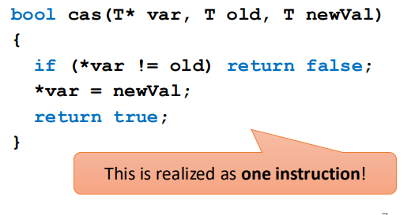
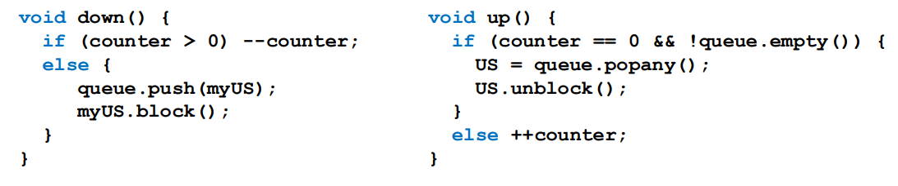
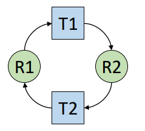
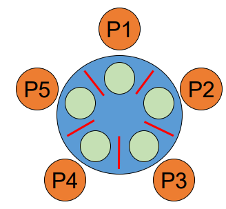

# Parallel programming and synchronization

## Parallel and concurrent computing
- Parallel computing
  - Calculations or executions of processes are carried out simultaneously
  - Bit-level, instruction-level, data, and task parallelism
  - Parallelism without concurrency – bit-level parallelism
  - The problem is broken into several similar subtasks, results combined
  - paralelismus řídí a vykonává výpočty vedle sebe, v jednu chvíli se vykonává víc věcí
    - jede to přes více jader
- Concurrent computing
  - Multiple computations (processes) are executed at the same time
    - vytváří iluzi toho, že víc procesů pracuje na jednou, ale každý vždy běží sám nezávisle na ostatních
      - funguje na single core systémech
  - Concurrent without parallelism – multitasking on a single CPU
  - Processes do not work on related tasks
- Forces
  - One (shared) address space - může se stát, že v jednu chvíli dva procesy (jednotky plánování) přistupují ke stejným
  datům najednou
  - Threads
  - Multiprocessing
  - Scheduling - vlákna se můžou chovat a měnit se, kdo počítá nepředvídatelně - preemptivní plánování, vlákno jako
  jednotka plánování může být kdykoliv zastavená ve výpočtu

## Race condition
- Race condition
  - Multiple threads accessing (updating) the same data in shared memory space
  - Cache coherency helps a little, but does not actually solve anything
    - data z paměti se můžou lišit mezi různými cache záznami na různých jádrech pro navzájem běžící procesy
  - Load-store architecture makes it more pronounced
    - každá operace měnící něco v paměti je obalená `load` a `store` instrukcemi a OS může dané vlákno přerušit po každé z těchto instrukcí
    a mezitím tam můžou přistupovat jiná vlákna
- The result of a computation depends on the sequence or timing of units of scheduling

## Critical section
- Problem definition
  - Concurrent access to a shared resource can lead to the race condition or even to an undefined behavior
  - je to část kód ve kterém vlákna přistupují ke stejným datům, kde je ale potřeba aby si data zachovala nějaký formát,
  což může být problém když tam pouštíme víc vláken najednou
- Solution
  - Parts of the program, where the shared resource is accessed, need to be protected to avoid concurrent access
- Critical section
  - Protected section of the program
- Mutual exclusion
  - A critical section can be executed simultaneously by at most one unit of scheduling

## Synchronization
- Process synchronization
  - Multiple units of scheduling do some form of a handshake at a certain point to make an agreement to a certain sequence of action
  - přidává trochu prediktabilitu, ale hlavně bezpečnost, ale zároveň i overhead výkonnosti
- Data synchronization
  - Keeping multiple copies of data in coherence with each other
  - Maintain data integrity
  - Usually implemented by process synchronization
- Problems with synchronization
  - Deadlock, starvation, overhead…

## Synchronization primitives
- Synchronization primitives
  - Implement process synchronization (in OS)
  - Active
    - Instructions are executed during waiting for an access
      - Busy waiting (testing a condition in a loop)
    - spotřebovávájí CPU time
    - používané, pokud se jedná o přístup k věcem, kde se porvádí málo instrukcí, čekání nebude dlouhé
  - Passive/blocking
    - The unit of scheduling is blocked until access is allowed
    - pracuje s plánovačem OS, používá se když data, ke kterým přistupuje vždy pouze jedno vlákno používá dané vlákno velmi dlouho
- Hardware support
  - Atomic instructions
    - Test-and-set (TSL), compare-and-swap (CAS) (oboje instrukce dělají stejnou operaci)
    - je to jedna hardwarová instrukce, co instrukce dělá je na obrázku pod tím
    - například se do proměnné zapisuje id procesu, základně tam je nula a když chce proces dál musí tam být nula a on tam pak zapíše svoje id přes jednu atomickou instrukci, když odejde dá tam opět nulu
    - Instruction semantics:

- Spin-lock
  - Busy waiting using TSL/CAS
  - Short latency, right for short waiting times
- Semaphore
  - Protected counter and a queue of waiting units-of-scheduling (US)
    - counter říká kolik vláken tam může najednou, vstupují vlákno ho sníží
  - Atomic operations UP and DOWN
  - zablokované vlákno při down operaci může být odblokované pouze při up operaci

- Mutex - dneska nejpoužívanější
  - Implements mutual exclusion (semaphore with counter = 1)
  - Atomic operations LOCK and UNLOCK (corresponding to UP and DOWN)
- Barrier
  - Multiple units of scheduling meet at the same time on the same barrier
- Specific programming language constructs
  - Monitor
    - Methods in an object executed with mutual exclusion
    - Possibility to wait on a certain condition
  - Java/C#
    - Keyword `synchronized`/`lock`

## Deadlock
- Deadlock
  - A state of a group of units of scheduling and resources, where every member of the group waits for an action, which 
  can be performed by other member in the group
- Necessary conditions for deadlock (Coffman)
  - Mutual exclusion
    - At least one resource in exclusive mode - alespoň k jedné věci může přistupovat pouze jedno vlákno (ta věc je exkluzivní)
  - Hold and wait
    - US holding a resource requests for another one - když jednotka plánování (vlákno) dostane zdroj, nepustí ho a chce
    pořád více zdrojů
  - No preemption
    - Resources cannot be reclaimed without harm - nelze jednotce plánování odebrat zdroj (bez toho aniž by se ona toho
    vzdala, což se nesane z předchozího bodu) bez nějaké újmy
  - Circular wait
    - There is a circle in a deadlock modelling graph
    - na obrázku

## Deadlock – example

## Classic synchronization problems
- Classic synchronization problems
  - Set of well-known synchronization problems
  - Demonstrate a problem using an allegory
  - Avoid deadlock, starvation, and other problems
- Bounded-buffer (producer-consumer)
- Dining philosophers
- Readers and writers
- Sleeping barber

### Producer-consumer
- Problem
  - Producer produces a product and he places it to the warehouse with a limited capacity. If the warehouse is full, 
  producer will stop production of products.
  - Consumer takes a product from the warehouse. If there is no item available, consumer will wait for an item.
  - If the warehouse is empty and producer produces the first product and there is a waiting consumer, producer will wake up consumer
  - If the warehouse is full and consumer takes the first product and there is stopped producer, consumer will wake up producer
- jaku u pipeline, jeden proces čeká na něco co je vytvářené jiným procesem a je tam buffer mezi nimi, který vyrovnává
rychlost vyváření a přijímání

### Dining philosophers
- Problem
  - N philosophers sitting around a circular table
  - Each philosopher has a plate of Chinese food in front of him
  - There is one chopstick between each dish, two chopsticks are needed to eat
  - The life of a philosopher consists of thinking and eating
  - každý chce začít jíst v jednu chvíli, každý napřed vezme chopstick napravo od něj a pak se snaží vzít ten nalevo od
  něj, což ale nemůže, protože ten tam už není - vytvořil se deadlock

- může být rozšířeno tak, že pokud nemůžou získat chopstick nalevo, pustí ten napravo, což ale deadlock vyřešit nemusí
- vyřešit tím, že se dá jedna slánka doprostřed stolu a každý si napřed musí osolit jídlo - mutex

### Readers and writers
- Problem
  - Common data structure
  - Readers are only able to read data
  - Writers change data or a data structure
  - Many readers may read simultaneously
  - Only one writer can change the data at a time
    - nesmí k tomu ani nikdo číst, pokud se zapisuje je tam pouze jeden writer a žádný reader
  - A reader must wait if there is a working writer
  - A writer must wait if there are working readers
- RW Lock - vytvoří pro tento problém
  - More difficult to make it fair/efficient

### Sleeping barber
- Problem
  - Barbershop with one barber, one barber chair, and N waiting chairs
  - When there is no customer, the barber goes to sleep in the barber chair
  - Barber must be woken when a customer comes in
  - When the barber is cutting hair, new incoming customers are waiting in chairs or leaving the shop, if there is no empty chair
- popisuje co se děje na webserweru
  - webserver má několik socketů, kam se posílají requesty a omezenou paměť pro vlákna, které můžou obsluhovat requesty
  když je moc requestů, tam je bude webserver odmítat

