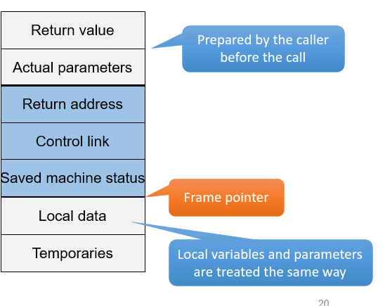

# Programovací jazyky
- naivní pohled na compiler je program, který dostane source code a vyplyvne kód, který jede na našem operačním systému a CPU
- překladač je vlastně zobrazení ze vstupního jazyka do výstupního jazyka

## Gramatika - naivní představa
- jazyk se skládá z:
  - pravidel, pravidla pro uzávorkování, jmen 
  - lexikálních prvků - `while`, `for`, `do`, čísla, středníky, stringy, funkce
- překladač kontroluje gramatiku, pokud je něco špatně, tak hodí error
- třeba C++ to má dané jasně ve, Python to má trochu na stránkách

## Pohled na překlad
- preprocessor - věci na začátku C/C++, hahradí preprocesorový kód samostatným kódem , např nahradí include kódem
  - v header filech může vlastně být pouze uvedeno interface, který má kompilátor očekávat, že dostane při likování,
  samotné metody atd jsou dodané při linkování
- compiler - v některých jazycích se dostávají další nesmysly (např importy v Pythonu)
  - pak se může převést na assembly - kompilátor může převést kód na assembly
  - assemblerová část může být vynechaná - může se jít rovnou ze zdrojáku na object
- přes assembler na objecty (assembler vezme assembly a udělá z nich objecty)
- linker vezme knihovny a objecty na executable code
- C má dnes Preprocessor, Compiler a Assembler v jednom, Assembler se úplně vynechává

## Linker/Librarian/loader
- Knihovna (library) - colekce kompilovaných modulů a jiných zdrojů
  - balík objectů v nějakém formátu
  - linker použije pouze objecty, které potřebuje -
  - statické linkování (.lib - win, .a - linux) - odsud ze extrahujou objecty při kompilaci a jsou uvnitř .exe filu, je zamrazená verze v době linkování
  - dynamické linkování (.dll - win, .so - linux) - je dodaná při runtime, při runtime se načte do paměti a získají se 
  tak objecty, lze měnit verze, program si tu knihovnu najde v operačním systému
- Linking
  - linker spojí výsledky různých překladů a spojí je s knihovnami a vytvoří executable file 
  - při likování se musí upravit adresy - Relocations
    - když linkuje soubory s knihovnami atd, je potřeba aby se v binárce uvedlo, co se má volat na co
  - position indepentent code - kód, který bude funkgovat na každé adrese v paměti bez žádných úprav
    - například tam musí být relativní skoky
- Loader - součást operačního systému, načítá executable do paměti(včetně dynamicky linkovaných knihoven)
  - opět provádí relokace - v kódu co je nahraný do paměti musí být správné adresy, na kterých je program spouštěn, 
  což je něco co se mění při každém spuštění

## Kompilování jako jeden projekt
- napřed se zkompiluje knihovna
  - preprocesor tam dá headery
  - zkontroluje se interface
  - vytvoří se object knihovny
- potom se zkompiluje soubor
  - vytvoří se object
- linker je na konci zlinkuje

## Kompilování rozděleně
### Statické linkování
- zkompiluje se knihovna jako u kopilování jako jeden projekt, ale object se dá linkeru, linker vytvoří .lib nebo .a soubor dané knihvny
- při kompilaci souboru se zkompiluje soubor - dostaneme object od kompilátoru
  - linker dostane object zkompilovaného souboru a soubor staticky linkované knihovny (.lib, .a) a zlinkuje je dohromady
  do konečného executable souboru

  - 

### Dynamické linkování
- knihovna se zkompiluje a zlinkuje, liker nám dá .dll soubor
- kompilovaný soubor dostane header s interfacem, který provádí knihovna v .dll
- při kompilování musí linker zkontrolovat, že knihovna v .dll souboru dodává všechny funkce a splňuje interface z headeru
  - .dll musí být dostupný at compile time
- do souboru musí být informace pro loader, aby při načítání souboru do paměti načet do paměti i knihovnu a relokoval 
všechny call atd.

# Memory Organization
- paměť procesu, program je na disku, proces běží
- jednotlivé části paměti se nazývají segmenty
- Code paměť se na některých architekturách ani nesmí číst (loadovat z paměti, to je čtení, CPU fetchuje instrukce, to je něco jiného)

### Linking
- zdroják A.C přeloženej CC (C compiler) vytvoří A.O (object)
- zdroják B.C přeloženej CC vytvoří B.O
  - v objectu jsou napsané segmenty každého programu
- PQ.lib - dva zdrojáky(moduly) (P a Q), každý má svůj object a svoje segmenty
- Linker vezme objekty a knihovny (PQ.lib) a vytvořit spustitelnej soubor
  - linker musí spojit segmenty, tak aby kód všech věcí co spojuje byl u sebe, konstanty všech zdrojáků co spojuje dát k sobě atd.
  - linker také vezme z knihovny (PQ.lib) pouze objecty (moduly), které jsou ve zdrojácích používané, proto je na obrázku v .exe pouze jeden object z PQ.lib
- Problém je s adresama (skoky), překladač začne kód každého zdrojáku od offsetu 0, na konci funkcí je nějaký skok, compiler tento skok označí, že je to špatný skok, protože neví kam se bude doopravdy skákat a o dopnění správných skoků se postará linker (toto se nazývá relokace)
  - relokace se dá obejít relativními skoky
- Linker ještě spojuje `extern` (extern je imo v headrech a ty headry specifikujou interface knihovny )a `public` (public je samotná veřejně dostupná implementovaná funkce)
fuknce spolu,
- Pokud compiler volá v jednom souboru funkci, ale nemá její implementaci - neví kam skákat - funkce je `extern`, dá kam skákat nuly a linker doplní cíl skoku

## Example

-   `dumpbin /SUMMARY file.obj`
-   `dumpbin /ALL`
-   `dumpbin /HEADERS`
-   `dumpbin /SYMBOLS`
-   `dumpbin /SECTION:.rdata`

### Relocations

-   `dumpbin /RELOCATIONS`

### Disassemble

-   `dumpbin /DISASM`

### Run-time

- Static language support
  - Compiler
  - Library interface
    - E.g., header files (C/C++)
- Dynamic language support (běhová podpora)
    - Run-time program environment - je to jeden nebo více objectů, který dělá všechno co je potřeba např.:
      - Storage organization - například nastatvení globálních neinicialyzovaných proměnných na nulu, to je v normě C
      - memory content before execution
      - Constructors and destructors of global objects - Constructory volané mimo `main()` funkci musí být zavolané před
      main funkcí, tyto kontruktory se volají více méně náhodně
      - vytvoří stdin a stdout soubory
      - jako poslední volá main funkci
      - po skončení main funkce po sobě uklízí - např spouští destruktory na globální objekty (kontruktory volané mimo 
      `main()` funkci), tyto objekty se níčí v opačném pořadí, než ve kterém byly inicializované
  - Libraries

### Function Call
- v ABI je určeno jaký registr 
- Activation record (stack frame) (aktivační záznam) - povinné části jsou return adress, control link, saved machine status
    - return value - základní typy se vrací v určitých registech podle ABI (myslím, to jsou konvence)
      - jazyky umožňují vracet i nějaké struktury - pokud volající fuknce ví, že volaná funkce vrací něco velké co se 
      nevejde do registru, tak na stacku připraví místo na návratovej objekt (return value) - pointer na místo kam se 
      má vracet tato obrovská struktura se dává jako tajný (nultý) parametr volané funkci
      - alokovaný prostor pro return value je jenom v případě, že návratová hodnota je tak velká, že jí nejde vracet přes registr
        - pokud se vracená hodnota vejde do registru, tak tam alokované místo není
    - pak na stack hodí parametry volané funkce (nemusí být, funkce nemusí mít parametry), někdy se paramtery předávají
  přes registry, obyčejně se přes registry dají dát 4 parametry, tyto paramtry musí být primitivní typy(klidně i pointery)
    - Return adress - pointer kam se má vráti IP při ukončení funkce
    - Control link - pointer na aktivační záznam volající funkce
    - Shaved machine status - sem se ukládájí hodnoty, které byly v registrech (v registrech co si drží hodnotu) před 
  voláním volané funkce, volaná funkce sem ty hodnoty ukládá pokud dané registry potřebuje (asi to ukládá ve chvíli, 
  kdy to potřebuje), při návratu do volající funkce se obnoví hodnoty v registrech
    - pak na stack přijdou localní proměnné
    - Temporaries - neví co toje (poslední na stacku )
- prostor pro return value a parametry funkce připravuje volající 
- Frame pointer ukazuje na aktivační záznam, v ABI je určeno na které místo v aktivačnímm záznamu se ukazuje
- Stack pointer ukazuje na konec stacku - za všechny lokální proměnné
- Calling convention
  - return value - kam se vrací - registr, paměť
  - role registrů - které registry jsou scratch (hodnoty se nezachovávají při volání funkce) a které preserve (zachovávají se hodnoty po volání funkce)
  - public name mangling

### Public name mangling
- ve volací konvenci je někdy nastaveno, že se mají kódovat názvy kunkcí, pro linkování, užívá se to při method overloading, je to trochu bordel
- je to kvůli method overloadingu, namespacům, metodám v třídách
- C#, Java na to mají vlastní toolchain

- Examples:
  - `long f1(int i, const char -m, struct s -p)`
  - `_f1 MSVC IA-32 C __cdecl`
  - `@f1@12 MSVC IA-32 C __fastcall`
  - `_f1@12 MSVC IA-32 C __stdcall`
  - `?f1@@YAJHPBDPAUs@@@Z MSVC IA-32 C++`
  - `_f1 GCC IA-32 C`
  - `__Z2f1iPKcP1s GCC IA-32 C++`
  - `f1 MSVC IA-64 C`
  - `?f1@@YAJHPEBDPEAUs@@@Z MSVC IA-64 C++`

### Call/return sequence
- kdo uklízí parametry (volaná nebo volající), to co daná metoda vytvoří to musí uklidit

### Parametr passing
- call by value
  - parametr je spočítán a value je poslaná přes stack (nejde takto ovlivnic nic mimo funkci, po ukončení funkce tato hodnota zanikne)
- call by reference
  - caller dává volanému referenci na proměnnou - na stack je pushnutá pouze reference na tuto proměnnou 
  - výstupní parametry - změna udělaná v této funkci je viditelná i mimo funkci - je změněná hodnota, která leží někde jinde, ne přímo na vrcholu zásobníku
- v C jsou pouze call by value, jde dát pointer (je to primitivní typ), ale musí se implicitně určovat, že se přistupuje k paměti přes pointer

### Variables
 - pojmenovaný kus paměti, který někde leží
   - má typ
   - storage
     - static data
       - global variables in C
     - stack
       - local variables in C
     - Heap
       - dynamic memory in C/C#
   - Dictionary (Python, PHP, JavaScript)
     - není přímo storage, je to dynamická struktura (jméno proměnné ukazuje na nějakou hodnotu), je s proměnnou uložený i typ - nemusí být explicitní typování
       - je to pomalejší, musí se vykonat více instrukcí

### Heap
- Storage for dynamic memory
- Allocate 
  - use all features from dynamic memory allocation
    - free blocks evidence
    - Allocations algorithms
      - Extremely simple and fast incremental allocation 
- Deallocate
  - Explicit action in some languages
    - C, C++
  - Automatic deallocation by garbage collection - C#, Java
    - remove burden and errors - not deallocating or deallocating twice
    - works with good knowledge of live objects and references

### Garbage Collection
- spustí se, když dojde paměť
- Automatic removal of unused memory blocks
  - Advantages
    - no memory leaks
    - faster allocation
    - heap consolidation
    - no dangling pointers - nejsou pointry někam kam nemaj z důvodu nedealokování
  - Disadvantages
    - worse performance - musí se zastavit program a spustit garbage collector aby uklidil heap
    - even execution stall
    - unpredicted behaivior
  - dnes tolik paměti, že se většinou paměť nedojde, takže garbage collector není vůbec spuštěnej
    - nevýhoda je, že u služeb, které běží dlouho, potom když dojde paměť, tak garbage collector běží dlouho i několik sekund
    - někdy jazyky počítaj s tím, že paměť nikdy nedojde, takže ani neřešej kterou paměť alokujou na paměti, prostě ví,
    kde skončily a na další suitable adresu naalokujou paměť
- GC Strategies
  - Tracing
    - Reaching objects from live objects - začne zespoda zásobníku (volacího) a vezme všechy refenrence do heapu a z 
    nich udělá DFS všech dostupných refencí z objektu na který má refenci, to udělá pro všechny stack framy a potom odstraní nenavštívené objekty na heapu
  - Reference Counting
    - problem with cycles, space and speed overhead
  - Advanced versions for languages with heavy use

### Portability

- Source code portability
  - CPU architecture
    - Different type sizes
      - C, C++
    - Fixed type sizes
      - C#, Java
  - Compiler
    - Different language “flavors” - dřív nebyly přenositelné skompilované progamy mezi překladači C++, 
    každý to zkompiloval troch jinak, dnes je zafixovanej C++ standart, překladače blízko sebe
      - C++ - gcc, msvc, clang, …
    - Use only syntax and library from a language standard - zajistí přenositelnost
  - OS
    - Different system/library calls - to je většinou zabalené do funkcí ve standartní knihovně, v C,C++ někdy potřeba 
    dělat syscally - potom buď zdroják pro různé OS, nebo podmíněné volání - volají se různé funkce podle toho na jakém operačním systému se program nachází
      - Linux, Windows
    - Sometimes easy
      - BSD sockets - Windows a Linux rozhraní pro síťování (windows ukradl linuxu)

### Portability by VM
- překlad do instrukcí abstraktního CPU - má stejný popis jako normální CPU (registry, instrukce)
- Binary” portability 
  - Old technique for ensuring portability of a code among different HW
  - Used by many “modern” languages
    - Java, C#
  - Compiler translates a source code to the intermediate language
    - Abstract instructions
    - Java: bytecode, C#: CIL
  - Native VM compiled for a given architecture
    - Java: JRE (Java runtime environment), C#: CLR (.NET Common Language Runtime)
  - VM interprets intermediate language in a sandbox (původně C# a Java pouze interpretovali instrukce, což je pomalejší), 
  ale VM kontrolovala jestli se nedělá neěco zakázaného
 
### Solving Speed Problems
- náhrada za přímou interpretaci mezikódu
- JIT - kód byl distribuován rozdělený do modulů tak jak byl napsán a překládal se ondemand (každý modul) a ukládal se do cache (musí být do cache, překlad je velmi pomalej)
  - Just-in-Time
  - Translate intermediate code to the native code on demand
  - ondemand překlad mohl způsobovat zaseknutí v programu
  - používané v C#, když se měří čas, který trval na vykonání metody, může se první a druhé volání velmi lišit, jelikož
  při prvním volání ještě nebyla metoda zkompilovaná
- AOT
  - Ahead-of-Time
  - Translate the whole program in intermediate code to the native code during the installation or when the program is loaded in the memory
  - v google storu (na androidu) může být pouze bytekod a překládán při stažení

