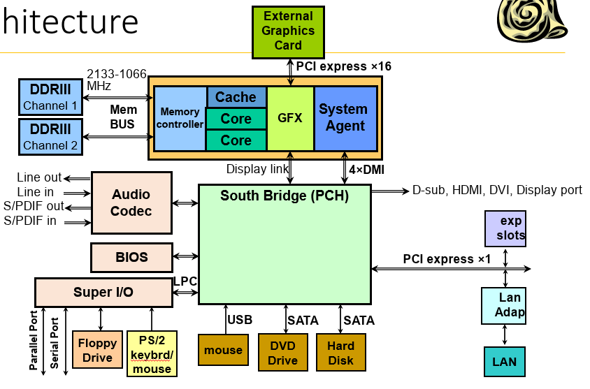

3# CPU

## Semantic gap
- assembly je jazyk na 0 a 1
- assembler překládá assembly do 0 a 1

## Von Neumannovská architektura
- jedna systemovaá zbernice, která je doopravdy slozena z vice zbernic
  - Control bus
  - Adress bus
  - Data bus
- program a data v jedné paměti

## Real PC architecture
- Sandy bridge

- CPU složen z více věcí
  - memory controller (má více kanálů, kterými lze přistupovat k pameti, každý channel k jednomu sticku), komunikuje po vlastní sběrnici
  - cache
  - GFX (grafika)
  - System agent připojen s South Bridge kam jsou připojeny I/O zařízeníw

# CPU Architecture
- Instruction set Architecture
  - abstract specification
- Hardware Architecture
  - samotné vytvoření CPU

# What is CPU
- mašina vykonávající instrukce (jednoduché příkazy)
- obsahuje registry, paměťové řadiče, můžou tam být paměťové datové struktury (registr kam dám odkaz do paměti, kde to je)

# CPU Commands
- každá instrukce CPU má binární kódování, s tím pracuje CPU, existuje Assembly - human-readable verze, binární kódy 
jsou nahrazeny slovy nebo zkratkami - assembler to přeloží do binárního kódování
- každá instrukce má opcode, pak můžou být operandy
- CPU může mýt více druhů kódování instrukce
- jsou procesory, kde je pevná délka instrukce, v jiných může být proměnlivá dékla instrukce a procesor podle opcode nebo a procesor se musí více rozhodovat, jak má co interpretovat
- pevné kódování (jmenuje se tak) - každá instrukce má pevnou délku (i s operandy)

## Operandy instrukcí
- záleží na ISA, maximálně 1,2 nebo 3 (něktré operandy mohou být implicitní - např operace bude implicitně pracovat s hodnotou v určitém registru)
- mohou být registry, immidiate values a asi adresy
- pokud potřebujeme načíst do registru číslo, který má více bitů než rozsah pevného kódování (je to ale nepravděpodobné) musí se to uděalat na více instrukcí

# Instrukční cyklus
- cyklus, který CPU neustále provádí dokola, některé části lze vynechat
  - obecně lze rozdělit do tří částí:
    - fetch
    - decode
    - execute
- probíhá následovně:
1. načíst instrukci (opcode) z adresy uložené v IP (PC) registru 
   - pevného kódování ví kolik bytů přesně přečíst, u nepevného kódování to čte tak, že po každém bytu se rozhoduje 
   jestli číst víc nebo ne
2. dekódovat instrukci, zjistit, co se má provést
3. načíst operandy (pokud je co načíst), do meziregistrů
4. provést instrukci (pouze NOP (no operation) nic nedělá)
5. uložit výsledek (pokud je co uložit)
6. increment IP, u pevného kódování se posune o délku instrukce, u nepevného kódování si to musí CPU pomatovat
- celá iterace se vždy musí provést celá (to se označuje, že je atomický cyklus), pokud se dělá něco mimo instrukce tak se to provádí mezi iteracema
- některé části se mohou skipnout pro některé instrukce

## add instruction execution example
- GAA, GAB jsou meziregistry, jsou to registry, které se používají při sčítání

# Třídy instrukcí
## Load instrukce
- načítání dat z paměti do registrů
- některé procesory mají load instrukce úplně oddělené od ostatních (předpokládám, že to znamená, že v jiných něž load 
instrukcích se nemohou objevit jako operandy adresy v paměti)
- dneska je veliký rozdíl mezi rychlostmi pamětí a CPU, CPU jsou mnohem rychlejší, což je dneska nějak řešené
- např x86 (stará a si celkem na hovno) nemá load operace, ale každá operace může pracovat s pamětí
- load-execute architektury, těchto architekturách jsou operace pouze s registry, pro operace můsí být napřed načtené 
hodnoty do registrů, určitými instrukcemi
## Store instruction
- registr/immidiate hodnota do paměti
## Move instrukce
- mezi registry
- nepřesouvá data, ale kopíruje data z jednoho registru do druhého
- v x86 je move mezi registrem a pamětí (těžce implementované hardwarove), náhrada za chybějící Load instrukce
## Aritmetické a logické instrukce
- +, -, <<, >>, &, |, ^, ~
- v novejsich CPU *, /, %
## Skoky
- dělení:
  - uncoditional - jednoduché, jenom se změní hodnota v IP
  - Conditional - CPU se rozhoduje jestli skočit, pokud podmínka splněna, CPU skočí jinam, podmínky záleží na architektuře (co lze porovnávat záleží na architektuře)
- jiné dělení, podle toho kde se vezme adresa kam se skáče:
  - direct - v instrukci je přímo adresa jako hodnota 
  - indirect - v instrukci je adresa do paměti, kde je uloženo kam se má skočit
  - relative - v instrukce je znaménkové číslo, při skoku se to číslo přičte k IP
## Call, return
- Call volá funci, call musí být speciální instrukce, dělá se tam i něco navíc
- return vrací IP do funkce ze které bylo voláno
### kód ve vyšším jazyce
to co tu je není úplně dobré
` if (a < 3) b = 4; else c = a << 2; `\
v assebly:\
`jge [a], 3` pokud `a` větší nebo rovno 3 (negace podmínky) skoč k else části, není tu uvedeno kam se má skočit (přesná adresa)\
`store [b], 4` uloží 4 do `b`, pokud není podmínka splněna\
`jmp` skok (nepodmíněný) za else \
else část:\
`load r1, [a]` načte `a` do registru `r1`\
`shl r1, 2` left shift `r1` o 2, v `r1` je hodnota a \
`store [c], r1` uložit do paměti, kde je `c` o 2 shiftnutou hodnotu `a` (`a` se doopravdy nezměnila)
# Registry
mají více typů registrů
- general(obecné registry, často používané jako úložiště mezihodnot výpočtů), integer, floating point
- address registry (sem se dávají pointry)
- branch registry - slouží pro realizaci skoků
- flag registry - jsou tu flagy
- predikátové registry - jednobitové registry, každá instrukce má napsané které číslo, je to staré (stará praktika), používá se pro 
větvení, každá instrukce je označená hodnotou registru (kde je buď 1 nebo 0) a podle toho se provádí nebo ne, 
podmíněný skok každou větev otaguje daným číslem podle výsledku podmínky
- aplikační registry
- systémové registry - 
- vectorové registry - registry mají více hodnot v jednom registru, nějak oddělené (něco jako array), dva takovéto registry
lze rychle sčítat v jedné instrukci

## Pojmenování registrů
- Direct (EAX, r01)
- stack - reltivní adresování na vrchol stacku (něco asi staršího)
- Aliasing - registr (fyzický) může být rozdělen na více částí a každá část se adresuje jinak

ukázka obrázek, je 32-bit x86:

EAX např adresuje celý 32 bit registr, AX adresa 16 MSb, AH 8 bitů a AL 8 LSb 
- registr EAX je akumulátor - akumulátorová architekture
- EBX - base registr
- ECX - count regist
- EXD - data regist, data ale mohl být i adresy
- ESI - source index - adresa zdroje
- EDI - destination index - adresa výsledku
- EBP - base pointer - kde má funkce lokální proměnné
- ESP - stack pointer - pro callování funkce

u x86_64 stejné akorát doleva přidáno 32 bitů a celých 64 bitů je RAX plus 
# CPU má dva režimy
- uživatelský (neprivilogovaný) - nelze v tomto režimu provádět úplně vše
- kernelový (privilegovaný) - v tomto režimu pracuje kernel operačního systému, v tomto režimu jsou dostupné systémové registry a navíc některé systémové registry

