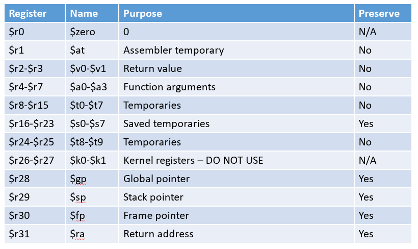
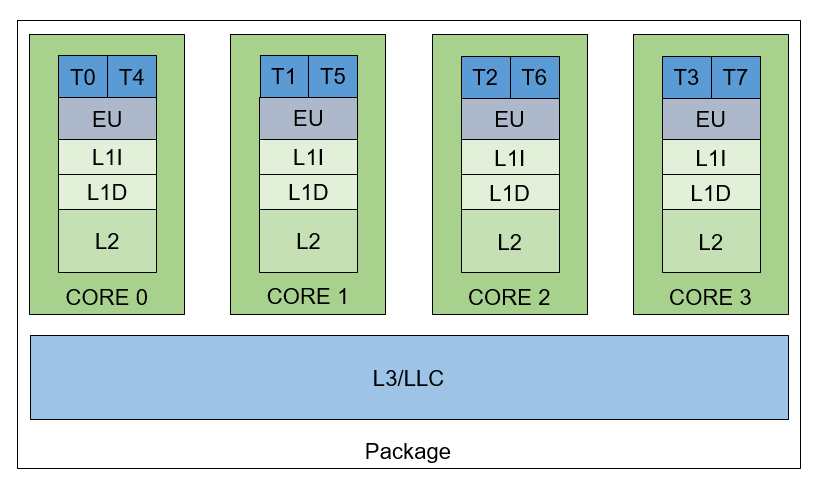
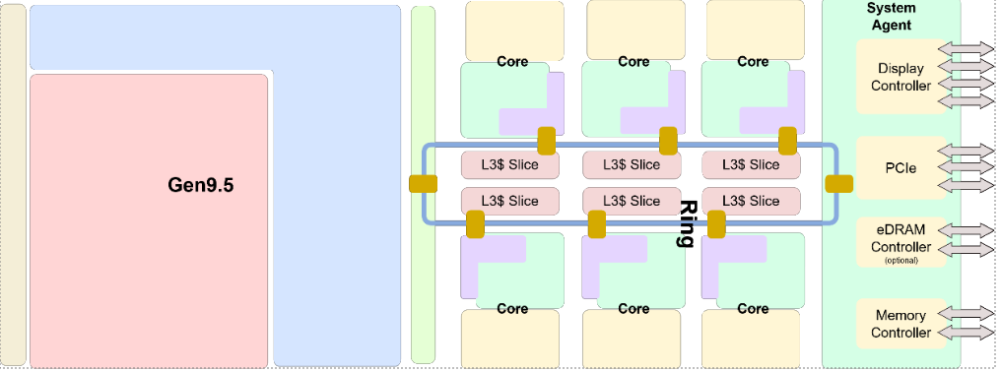
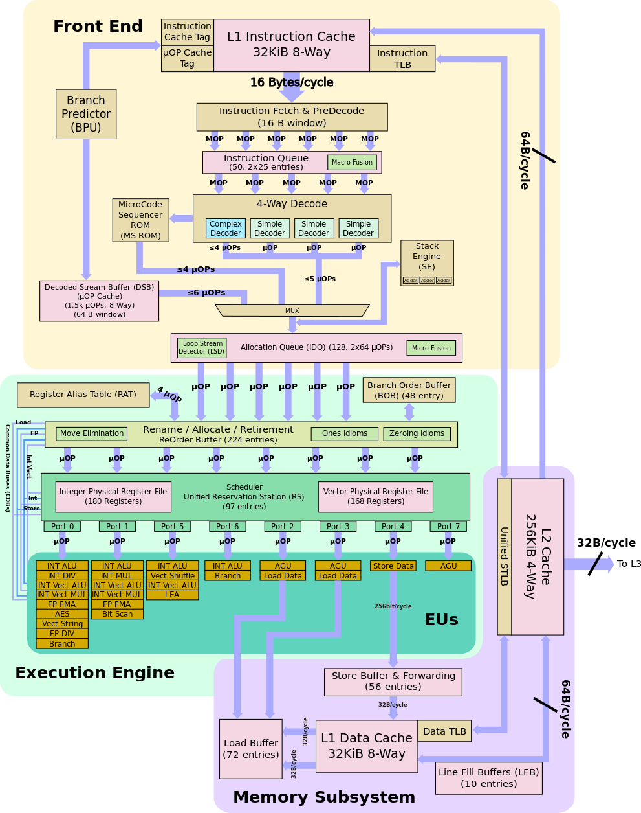
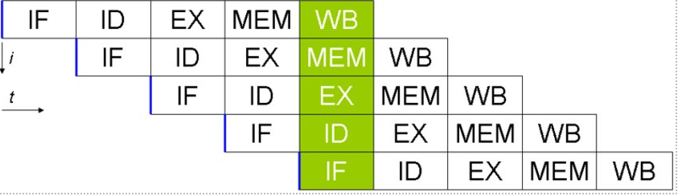

# MIPS Assembler
- [ISA](https://www.cs.gordon.edu/courses/cs311/handouts-2015/MIPS%20ISA.pdf)
- 32 bit registry r0 až r31
  - obecné registry - lze zapisovat, skákat
  - r0 neudrží informaci, po čtení vždy vrátí 0, a při zapsání do něj se ta hodnota ztratí
  - r31 je registr pro instrukci jal
- není hardwarovej zásobník (není pro něj registr), třeba v x86 je zásobníkovej registr, stack musí být realizován softwarem
- nemá příznakový registr
- má PC

## Application Binary Interface (ABI)
- přídavná specifikace, která je navíc spolu s ISA
- říká, jak má být architektura používaná
  - důležité pro vytváření překladačů (např.: který registr použít jako stack registr)
  - je to potřeba aby byly kompatibilní programy s knihovnama, které byly kompilované jinak
- říká jak pužívat registry, jak implementovat call stack, konvence volání funkcí

## MIPS ABI
### registry
- r29 stack pointer
- registry mají jiné pojmenování v ABI
- ABI určuje konvence volání funkcí, nebo jak je implementován stack
- t0 - t9 registry pro proměné
- v0, v1 registry pro návratové hodnoty, LE, LSB jdou do v1
- a0 - a3 - těmito rgistry se předávají první 4 parametry funkce (proto je rychlejší používat maximálně 4 parametry)
- Preserve pokud No volaná funkce může změnit registry, pokud Yes může volaná funkce tyto registry změnit, ale na konci 
funkce musí být v registru stejná hodnota jako před voláním

### MIPSové instrukce
#### Aritmetické
- `add $rd, $rs, $rt` 
  - R[rd] = R[rs] + R[rt]
- `addi $rd, $rs, imm16`
  - R[rd] = R[rs] + signext(imm16) - 16 se roztáhne znaménkově
  - s immidiate hodnotou
- obdobné pro odčítání
#### Bitové operace
- vždy to má formát  `instrukce cil, zdroj, zdroj`, immidiate hodnoty jsou 16 bitové
- and, andi
- or, ori
- xor, xori
- nor - or, kterej je potom negovanej
- není negace, implementované pomocí nor, hodnota z registru r2 se zneguje do r1 takhle: `nor $r1, r2, r2`, jde i jiným způsobem (přes xor a jednotkovou masku)
- Shifty
  - sll, slr - logické shiftování (nezachovává znaménko, šoupne tam na začátek nulu) `instrukce cil, zdroj, shamt` (shamt říká o kolik bitů posunout)
  - sra - aritmetické shiftování (zachovává znaménko, dáva smysl jen doprava)
#### Memory Access
potřeba doplnit - není potřeba umět
- li $rd, imm32
  - intrukce, která dá immidiate hodnotu délky 32 bitů do registru 
  - ve skutečnosti je přepsaná na více jiných instrukcí (takové instrukce nejsou možné, jelikož je pevná délka instrikce 32 bit)
#### Jumps
- `j addr`
  - PC = addr
- `jr $rs`
  - PC = R[rs]
- `jal addr`
  - jump and link
  - R[r31] = PC + 4
  - PC = addr
  - na návrat musíme dát `jr $r31`
#### Conditional jumps
- `beq $rs, $rt, addr`
- `bne`

#### Testing
- slt/slti
- slti/sltiu
- když porovnávám v podmínce, tak udělám jednu z těchto instrukcí a pak výsledek porovnám se zero registem, ne všechny porovnání lze udělat tímhle, lze to udělat přes více instrukcí

# Flags
- used only by some ISAs
- zero flag
- sign flag
- carry flag
- overflow flag

# ISA
- klasifikace
  - CISC - Complex instruction set computer - x86
  - RISC - Reduced instruction set computer - RISC-Vw
  - VLIW - very long instruction word - velké instrukce třeba 128 bitů, instrukce dlouhé, ale nebylo dekódování instrukcí, v instrukcích byly pokyny pro různé části procesoru (někdy v síťových switchích)
- ortogonalita - v libovolném místě lze využít libovolný registr
  - např akumulátorová architektura nebo architektura s stack pointer registrem nejsou ortogonální
- Load-Execute-Store - jsou load/store instrukce, všechny ostatní operace jsou s registry (MIPS)

# Obsah procesoru
- memory controller - dnešní CPU mají více controllerů
- cache hierarchy - několikavrstevná
- jádra
  - registry - každé jádro má své registry, ty registry co jsou vidět v ISE
  - může existovat více fyzických jader
  - logické procesory - na jednom jádře běží více stringů instrukcí (dneska běžně $2$), každé logické jádro má svoje registry, ale sdílejí výpočetní jednotku
    - Intel to nazývá Hyper threading
    - vlákna poskytují až 50% nárůst výkonu
    - některé CPU můžou mít i 4 nebo 8 vláken (serverové), dá se tím schovat přístup do paměti (když se přistupuje do paměti jádro vykonává něco jiného)

## CPU Scheme
- jsou tam jádra
  - T0, T4 - vlákna
- Cache - mají různou rychlost a velikost
  - L1 - přístup sem třeba 6 taktů, každé jádro svoje
    - L1I 
    - L1D
  - L2 128 - 256 kB, přístup desítky taktů, každé jádro svoje  
  - L3 - sdílené mezi všemi jádry - každé jádro má svůj slice

## REAL CPU
- intel Coffe Lake
- vlevo integrovaná grafika - je připojená na ringu s jádry
- RING je interní sběrnice pro komunikace jádry s pamětí, tato zběrnice lze uděat jinak (MESH)
- L3 slice - každé jádro má svůj prostor (část) v L3 a pokud chce jádro něco mimo svůj slice musí požádat jádro kterému to patří, přístup do L3 není vždy stejný

## REAL CPU schema jádra
- front end dekoduje instrukce, je pěticestný dekoder - dekoduje pět instrukcí najednou, každá část dekoderu může být jiná (to platí pro architekturu na obrázku)
  - je to celkem složité u x86 - jsou rozdílné délky instrukcí
- instrukce jsou v předělané na mikroinstrukce
- Rename/Alocate/Retirment jednotka - tahle jednotka je zodpovědná za to, aby vše bylo jak má být
  - např renamuje registry v ISA na actual registry v CPU (to tam je, basically něco jak virtual memory, akorát fyzických egistrů je víc než registrů v ISA)
  - renaming je dobrý třeba když je za sebou více instrukcí, které na sobě nazávisí, ale potřebují podle ISA použít stejný registr
například na výsledek násobení, potom když je více takových registrů, tak se ty více nezávislých intrukcí může vykonávat najednou
- mikroinstrukce propadnou nějakými obvody až do instruction poolu - scheduler
  - ve scheduleru jsou mikroinstrukce připravené na to aby byly executed
- Execution engine - zpracovává mikrointrukce
  - jedno jádro má více execution enginů, každý je zodpovědný za vykonávání trochu jiných instrukcí
- ze scheduleru jdou mikroinstrukce přes několik portů k přislušným execution enginům - na obrázku, co je za portem jsou dostupné execution enginy za daným portem
- celé tohle zaručuje, že lze interně vykonávat instrukce v jiném pořadí než v pořadí ja jsou v paměti - instrukce, které nejsou 
závislé na výsledcích předchozích instrukcí lze vykonávat out of order, ale zvenku pořád to musí vypadat tak, že intrukce jsou 
vykonávané sekvenčně
- část s execution enginama je spojená s memory subsystémem 

## CPU architecture - Pipeline
- instrukce se rozdělí na stage
  - dneska 14 až 19 stagí
- IF - instruction fetch
- ID - instrukction decode
- EX - execute
- MEM - přístup do paměti, pokud to instrukce potřebuje - např LOAD, STORE instrukce
- W|B - write back - data načtená z paměti nebo vypočítaná data jsou načtena do cílového registru
- vždy je více intrukcí vykonáváno najednou u každé intrukce se vykonává jiná stage a instrukcí se vykonává tolik co je stagí
- past je u podmíněných skoků - CPU si to uvědomí až třeba ve třetí stagy (na obrázku), takže začala načítat sekvenčně špatné instrukce, takže vše špatné (všechny stage za touto instrukcí)se musí zahodit a začít znova načítat instrukce - chvíli se nebude počítat
  - dnešní nové CPU mají branch predictor (odhadne jak se bude skákat a podle toho bude načítat instrukce) má asi 95% účinnost
- pipeline je schovaná v dekoderu
- superscalar pŕocessor - více pipeline najednou, u pěticestného dekoderu je 5 pipeline

## CPU architecture - out of order execution
- reservation station (pool) - sem padají mikroinstrukce z dekoderu
- různé mikroinstrukce jdou přes různé porty - může se instrukce vykonávat v různém pořadí než přišly
(každá instrukce ví do kterého portu může)
  - o tohle se stará reorder buffer
- každá instrukce se vykonává podle toho jestli má dostupná data potřebná k exekuci
- na venek to musí vypadat tak, že se intrukce vykonávají sekvenčně

