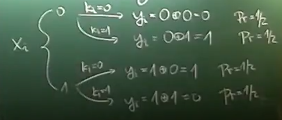

# Lecture 2

- "^" is xor operator
## Birthday Attacks
- b-bit nonces
- N is the set of all nonces, $n=|N|$
- m attempts
- f uniformly random function from $[m]$ to $[n]$
- Attack fails $\Leftrightarrow$ f is injective

$$
P[f\ injective] = \frac{injective\ functions}{all\ functions}=\frac{\frac{n!}{m!}}{n^m}= \frac{\prod_{i=0}^{m-1}n-i}{n^m}
= ∏_{i=1}^{m+1}(1-\frac{i}{n})≈∏_{i=1}^{m+1}(e^{-\frac{i}{n}}) = e^{-\frac{∑_{i=1}^{m+1}i}{n}}=e^{-\frac{m(m+1)}{2n}}≈e^{-\frac{m^2}{2n}}
$$ 
For a given $n$, find m that: $P[f\ injective]= ½ $, after calculating $m=\sqrt{2\ln 2}\sqrt{n} = $
- this implies that if $n$ is $2^l$, where l is security level, then security level is actually approximately half of
what we expected

### Challenge response attack
- Phase 1
  - Collect s different pairs:
    - challenge and correct response
- Phase 2:
  - ask for t nonces
  - wait for known nonce

- there is n possible nonces, attacker has s nonces
- there is t attempts (there is function f from $[t]$ to $[n]$)
$P[one\ attack\ fails] = 1-\frac{s}{n}$
$P[all\ attacks\ fail]= (1-\frac{s}{t})^t ≈ (e^{-\frac{s}{n}})^t $
we want $st ≈ n $
- $ s=t=\sqrt{n} $
space is $\Theta(s)$
time is $\Theta(s+t)$

## One time Pad cipher
- Message is $x \in \{0,1\}^n $
- Key is $k \in \{0,1\}^n $
- Encryption $y = E(x,k):= x ^ k $
- Decryption $ x = D(y,k):= y ^ k $

### Security of cipher
- Consider $k$ uniformly random

- $x_i$ is either 0 or 1
  - from picture above can be seen that every encrypted message is sequence of independently random bits, because no matter
  what value of $x_i$ is, if k is uniformly random, there is same probability od $y_i$ being 0 as it being 1
- bit flip of $y_i$ results of bit flip of $x_i$ in decrypted message

#### Theorem (perfect security)
if $k$ is uniformly random, then $y$ is also uniformly random

### Reusing key
- consider $x, x' \in \{0,1\}^n$, encrypted by $k \in \{0,1\}^n$
- $y = x \text{^} k$
- $y' = x' \text{^} k$
- $y \text{^} y' = x \text{^} x'$ - from this can be derived differences between messages
  - from this information a lot of information can be derived
  - it is useful in situations where for every message new key is generated
  - keys can be generated in advance and then used on messages as they need to be sent

### Algebraic Group
- abelian group $(G, +)
- $G = \{0,1\}^n$
- k is uniformly randomly selected from $G$
- $E(x,k)= x+k$

## Secret Splitting
- two parties encrypt certain information, want to be able to decrypt only when both parties are present
- one party cannot have any information about the part of the secret that the other party possesses apart from size
- $x \in \{0,1\}^n$ secret
- $k \in \{0,1\}^n$ chosen uniformly randomly given to one party
- $y = x \text{^} k$ given to other party
- when two parties want to see information they just xor the parts they have

### Generalization - (k,l)-threshold scheme
- given secret x 
- randomized algorithm producing k shares from secret x, such that
  1. from any l shares we can reconstruct secret
  2. from any less that l shares we have no information about secret x

#### (k,k) - threshold scheme for $X = \{0,1\}^n$
- secret $x\in \{0,1\}^n$
- shares $y_1,....y_{k-1} \in \{0,1\}^n$ are uniformly random independent 
- share $y_k = y_1 \text{^}..... \text{^} y_{k-1} \text{^} x$
1. correctness: if we have all keys we just xor all the key, then in the equation all keys will be there twice and will cancel out and x will remain
2. security (less than k shares)
   1. $y_k$ is missing - we have just independent random bit
   2. some $y_i$ for $i<k$ is missing - for every secret x there is only one $y_i$ possible uniformly random

## Facts on polynomials
1. if $\alpha_1,.....\alpha_t $ are all the roots of polynomial p(x), then $p(x) = (\prod_{i=1}^t(x- \alpha_i) )\times q(x)$, 
where $q(x)$ is polynomial without roots
2. a non zero polynomial of degree $d$ has at most $d$ roots 
3. if $p,q$ are polynomials of degree smaller than $d$ and $p(x)=q(x)$ for at least d different values of $x$, then $p=q$
4. for $x_1,...,x_d$ pairwise distinct and $y_1,....,y_d$ arbitrary (libovolné) exists exactly one $p$ polynomial of degree
less that $d$, that: $\forall i \in [d]:p(x_i)=y_i $

## Shamirs (k,l)-scheme
- over a finite field $F$
- $a_0,.....,a_k \in F$ distinct
- generate $y_1,....y_{l-1} \in F$ chosen uniformly randomly
- find plynomial p of degree < l which goes through points $(a_0, secret), (a_1,y_1),...,(a_{l-1}, y_{l-1})$
  - this polynomial is unique
- find $y_l,....,y_k: y_i = p(a_i)$