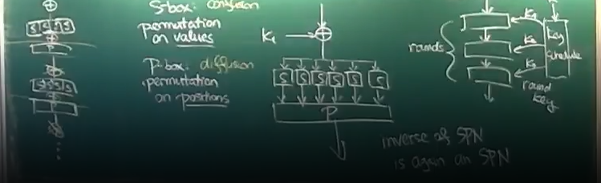

# Lecture 3

## Symmetric ciphers
- two basic design principles
  - block ciphers
  - stream ciphers

## Stram ciphers
- derived from one time pad
- pseudorandom bit generator produces keystream
- keystream is a sequence of bits
- xor keystream with text and produce ciphertext
- stream ciphers have two parameters
  - keystrem
  - iv (initial value) - some kind of nonce, does not have to be private
    - must be unique, cannot repeat
- stream ciphers commute
  - if having two keys and encrypt message with two keys, it does not matter in what order you decrypt message

## Block Cipher
- block ciphers process fixed blocks of data
- encryption function is a mapping $E:\{0,1\}^b \times \{0,1\}^k → \{0,1\}^b$
- usually can be with fixed key $E_k:\{0,1\}^b → \{0,1\}^b$
- function is permutation on block values

### Attempt to define security
- verifier - randomized algorithm
  - has no input 
  - verifier has oracle
    - oracle is $E_K$ with random key K or uniformly random permutation
  - goal of verifier is to tell whether the oracle is perfectly random permutation or block cipher with random key
  - cipher is secure when there is no good verifier which proves that the function is not random enough
    - there is no verifier with probability of success $\geq \frac{1}{3}$ and run time $<2^{security\ level} $ 

## Iterated cipher
- multiple round of ciphers
  - rounds are usually identical
- key schedule
  - for each round generates new key round key
- every round gets result of previous round as input plain text and encrypts this plain text using corresponding round key
- decryption is reversed iterated cipher

### Constructing round
#### SPN - Substitution permutation network
- round consists of three kinds of steps
- Sbox (substitution box) is permutation on values (permutates values)
  - does confusion - transforming the data so that the result has nothing to do with input
- Pbox is permutation on bit positions
  - does diffusion - make sure that flipping bit in encrypted text is propagated to whole message
1. get input and xor it with rounds key
2. splits the block into groups of 4 or 8 bits and each group is transformed by Sbox
3. Pbox gets result from sbox

- inverse of SPN is SPN, pbox and xor can be reversed in a sequence - then inversion is SPN

#### Feistel network
- input to round is split into 2 parts (Left and Right)
- Feistel function
  - gets the right half and round key and generates something
- product of feistel function is xored with left part
  - right part is not modified and left part is modified according with product of feistel function
- round ends with swapping left and right part so that in next round the right part of this round gets modified

## DES - digital encryption standart
- block cipher example
- for today's standards is weak, should not be used
- good example of bad example
- 64 bit blocks
- 56 bit keys (technically 64 bit keys, top most bit in byte is parity bit - it has no purpose in cryptography, dont know why its there)
- Feistel network with 16 rounds
- Feistel function
  - input is 32 bits
  - how it works:
1. expansion - expands input to 48 bits
   - input is split into parts of 4 bits and each part borrows last bit of part on the left and first bit of part 
   on the right, first and last parts do it cyclically
   - produces 8 6 bit parts
2. round key is 48 bit key, parts are xored with round key
3. parts go to identical sboxes (not invertible sboxes), sboxes produce 4 bit output per part (sbox gets 6 bits per part and produces 4 bits)
4. pbox permutaes the resulting 32 bits

- at begining and end of cypher there are permutations
  - no reason for it to be there, does not add security
- DES was meant for HW implementation
  - it is easy implement in HW
  - can be tricky and slow to implement in SW
- key schedule gets 56 bit key and produces 16 round keys, 48 bits per round key
  - every round key contains subset of bits from original key, these bits are permutated in round key

### Critique of DES
- DES has weak keys
  - if key is all 0, then all round keys are zeroes (because of how they are constructed), then feistel function is key independent
    - then decryption is same as encryption
  - same is with key of all 1 - bit are just 8 times flipped
- DES commutes with binary complement (in bin. complement bits are flipped)
  - encrypting complement of message with complement of key the cipher text is complement of cipher text produced when encrypting text with key
- Key size is too small
  - there was even a company providing DES cracking when give text and cipher text 
- Block size is too small - $2^32$ possible blocks - block collision can be possible

### Attacks on DES
- best attack is in $2^{43}$ pairs - cipher text and plain text

### Double DES
- have two keys
- run data through DES twice
- security level max 57 - exercise beat it

### Triple DES
- have tree keys
- run data through DES three times
- security level is $2\times 56 +1$

## Rijndael (AES) cipher
- is suitable for HW and SW implementations
- 128 bit blocks
- 128 to 256 bit keys
- SPN with linear transformation (invertible linear transformation)
- byte oriented
  - bytes are in some steps considered elements of galoais field $GF(2^8)$
- block is always viewed as 4 by 4 byte matrix
  - this is same for block and round key

### Round
- 4 steps
1. Byte Sub (S-box), every element in matrix is ran through S-box
2. ShiftRow - every row in matrix (block) is shifted by certain number of bytes
3. MixColumn - every row (vector in $GF(2^8)$) is ran through invertible linear transformation
4. AddRoundKey - xor current matrix with round key matrix

- MixColumn is not in last round
- Before first round is extra AddRoundKey

#### Inversion
- when inverting you can do steps backwards, but step 3 and 4 almost commute and steps 1 and 2 commute, so they can be
swapped with minor modification when swapping 3 and 4 and then when arranging mutliple round after one another it will
look just like encryption with inverted sboxes and linear transformation

### AES problems
- it has nice algebraic structure
  - when someone finds efficient way to solve these algebraic problems
- small round margin
  - small gap between number of rounds for what there are attacks and number of rounds that are secure and reasonably fast
- byte aligned - all operations are in bytes - faster software implementation, but diffusion is more regulated than it could be
- 128 bit keys are probably too small against quantum computing
- 128 bit blocks are too small - colision danger
  - solution is changing keys after something like $2^32$ blocks

- there is no known practical attack on AES apart from implementation atacks

