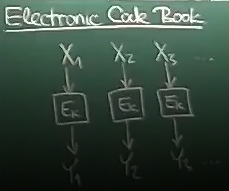
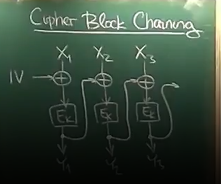
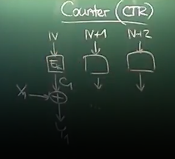
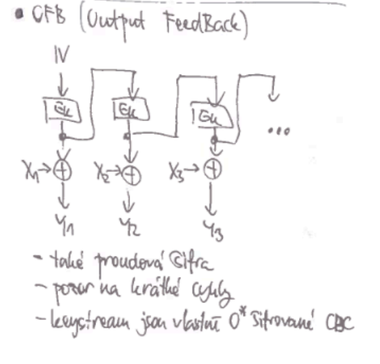
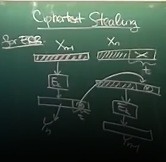

# Lecture 4
- IV - initialization vector, some random, pseudorandom, unpredictable or unique value used as initial value for encryption process

## Handling of a message length not being divisible by block size
- padding
- block cipher modes

### Padding
- the last part, that is not complete block is completed by padding
  - padding must be reversible and recipient should be able to tell it is padding and recipient should be able to do so
  without transporting the message length
- there must be P bytes added at the end
  1. repeat P times byte of value P at the end
  2. P value at the end and $P - 1$ random bytes before it
  3. also nonzero hexadecimal byte (f.e. 0x80) and then $P - 1$ zero bytes
- padding can be used as security - recipient checks if the padding has the right syntax
  - if the length of message is divisible by block size, there must be padding block added at the end

## Modes of block ciphers
- ECB — electronic code book
  - encrypt every block using encryption function independently
    - every block is encrypted independently on others
    - can be parallelized
    - two identical messages are encrypted the same
    - if there are two similar blocks in a message, then both blocks have the same cipher text block
    - changing one bit in a block is propagated only in one block
    - it's not good, should not be used

- CBC - cipher block chaining
  - before encrypting block using encryption function, block is xored with cipher text block of previous block, first
  block is xored with unique random IV
  - CPA secure - is secure against chosen plain text attacks
    - but can leak some info, especially when a message is long
  - flipping one bit in cipher text results in destruction of the corresponding plain text block and flip one bit in the next plain text 
  block (this plain text block will be xored with cipher text block with flipped bit as last step of decryption)
  - swapping two cipher blocks destroys four blocks - block that are swapped and blocks that are decrypted using swapped blocks
 

- CTR - Counter
  - some random IV is encrypted using block cipher (encryption function) and first block is xored with encrypted IV
    - next block is xored with encrypted IV + 1
  - blocks can be encrypted and decrypted independently
  - IV must not be reused
  - flipping bit in cipher text flips one bit in plain text
  - swapping two cipher blocks destroys plain text block

- Output FeedBack
  - simmilar to CTR, but it first encrypts IV and then encrypts encrypted IV
  - blocks cannot be decrypted and encrypted independently

## Attacking block cipher
### Attacking Padding
- needs padding oracle
  - message is padded, encrypted and sent, recipient recieves cipher text, decrypts and removes padding, padding removal
  may fail, padding oracle is back channel that tells sender or attacker that the padding removal failed
  - protocol has padding oracle if we can tell, that the message recieved by sender had incorrect padding
  - connection must be closed at some point - and when reciever gets message with incorrect padding, then he just dumps the message and closes connection
    - time it takes recipient to close the connection can be measured and after having the time there is possibility to tell
    if the connection was closed because of incorrect padding

#### Padding oracle attack for CTR
- multiple block message, last block padded using first padding mode
- using padding oracle recognize size of padding (this size will be known as P)
  - recognizing padding size is 1 byte - modifing second to last byte wont give padding error (because that byte is not part of padding - padding wont be incorrect)
  - recognizing padding size grater than 1 - try to modify all combinations of last byte, every modification will give padding error apart from
  modifing that gives decrypted byte of value 1 - valid padding, because in CTR bit flip in cipher text flips bit in plain text - from mask, that modified
  byte to 1 in plain text i can derive padding value
  - padding oracles are hard to avoid
- i know size of padding (P) - i know what value are the last P bytes - modify final block that last P bytes have value P + 1
  - if no padding error - last value of plain text is P + 1, otherwise try all combinations of bit flips on last byte of text till no
  padding error - we have mask that changes last plain text byte to value P + 1, so because bit flip in cipher text flips bit in plain text,
  wh have value of last byte of message
- same trick can be played on all bytes in last block, every byte can be recovered in 256 attempts (all possible bit masks for flipping)
- last block can be chopped of and same thing can be applied on remaining blocks (last byte in block that is now last will be guessed by changing it to 1)
- iterate this until whole message is intercepted

##### Padding oracle attack for CBC
- last block caontains some data and padding its xored with cipher text of previous block and encrypted
- same technique as attack on CTR can be used, but bitflips must be done on previous block (when decrypting n th block, 
bitflips are done on n-1 th block) 
  - first block cannot be decrypted that way - there is not previous block to xor with
    - if IV is random string that is sent along, then IV can be bitflipped, otherwise it cannot be broken (f. e. IV is 
    generated by hash function)

### Information leaks in block cipher modes
- block ciphers mode and all encryption based on block have inforamtion leaks, f. e. ECB leaks equal identical blocks

#### CBC leak
- two cipher text blocks ($Y_i,Y_j$) are equal\
$Y_i = E_k(X_i \text{^} Y_{i-1}) = E_k(X_j \text{^} Y_{j-1}) = Y_j$\
$ X_i \text{^} Y_{i-1} = X_j \text{^} Y_{j-1} $\
$ X_i \text{^} X_j = Y_{i-1} \text{^} Y_{j-1}$
- leaks amount of information that is equal to lenght of block if two cipher text collision happend
  - on average this information is leaked every $2^{\frac{lenght\ of\ block}{2}}$
- two equal blocks leak the difference between those two blocks decrypted

#### Leaks for CTR
- no two values that are used to xor plain text  blocks ($C_i, C_j$) are equal (different values are set as input tothe same encryption function)
- two cipher text blocks ($Y_i, Y_j$)\
$Y_i \text{^} Y_j = (X_i \text{^} C_i) \text{^} (X_j \text{^} C_j)$\
$Y_i \text{^} Y_j = (X_i \text{^} X_j) \text{^} (C_i \text{^} C_j)$\
$\Rightarrow X_i \text{^} X_j \neq Y_i \text{^} Y_j$

- how much does this leak: b is the amout of bits - information in block
  - leaked info is equal to: $b - \log (2^b - 1)$, its because one possible value of block is excluded
  $b - \log (2^b - 1) = \log (\frac{2^b}{2^b - 1}) = \log (1 + \frac{1}{2^b - 1}) \approx \frac{1}{2^b - 1} \approx \frac{1}{2^b} = 2^{-b}$
    - first approximation of logaritm: for small $\epsilon$: $\log(1+ϵ) ≈ ϵ$
  - over all pairs in message is less than equal $\binom{n}{2} × 2^{-b} ≈ m^2 × 2^{-b} $, $ m ≈ \sqrt{2^b} $
    - once the number of block reaches $\sqrt{2^b}$ the amount leaked approches one bit
      - all messages should be shorter than $\sqrt{2^b}$ blocks

## Cyphertext stealing
- trick to avoid padding in block ciphers (replacment for padding)
- work only if message has at least one full block

### Cyphertext stealing for ECB
1. all blocks apart from last two ($X_{n-1}, X_n$) are encrypted as usual (size of unused part of last block is $t$)
2. encrypt $X_{n-1}$
3. take last $t$ bytes from $X_{n-1}$ (remove them from the block completely) and put them as padding to $X_n$
4. encrypt last block padded with last $t$ bytes of $X_{n-1}$

## Stream Ciphers
- can be easier to implement in HW (most traditional protocols, but those are usually proven to be weak)
- stream ciphers avoid problems with padding and padding oracle attacks

- stram cipher is xor with keystream, but there are ways to implement keystream generator

### LFSR - Linear Feedback ShiftRegister
- shift register is part of memory of lenght n and on each HW clock tick one SHR is done on register and what gets lost
from register is output, on left is added bit that is xor of some bits in register (adding is called feedback - feedback
is adding to left of register), bits that are xored are called taps
- LFSR is determined by:
  - size of register
  - position of taps
  - initial state (must be nonzero)
- LFSRs tend to bee good pseudo generators with
  - if position of taps satisfy some things and initial state is nonzero, then period in $2^{n-1}$
  - not great cryptographic pseudo generators
    - by looking at output we can get initial input (if we know size of register and look at it from begining) and then
    through some linear equations taps can be derived

## Trivium cipher
- cipher for HW with small computing power

## Salsa 20 cipher
- not used, improvement is Chacha 20 (one of the most popular ciphers today)

