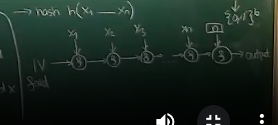

# Lecture 5
## Hash function
- mapping $h: \{0,1\}^* → \{0,1\}^b$
- requirements:
1. function should be effectively collision-free
   - nobody should be able to efficiently find collision (it should be impossible to find two different strings of bits 
   that map to the same value using mapping h)
2. second preimage collision 
   - when given value, we cannot find a value that has the same hash
3. function should not be invertible
   - given hash we cannot find value that hashes to given hash
- $1\Rightarrow2\Rightarrow3$

### Merkle-Damgård Construction of hash function
- suppose we have a compression function $f: \{0,1\}^b \times \{0,1\}^b → \{0,1\}^b$
- when hashing sequence of blocks $x_1,...x_n$ (if size is not multiple of block size, the sequence is padded, everything
that is true about padding in symmetric ciphers is true here)
- we take $IV$ (initial value - fixed) and $x_1$, compress then together, creating first intermediate result: 
$I_1 = f(IV, x_1)$, then take $I_1$ and compress it with next block: $I_2 = f(I_1, x_2)$, basically: \
$I_1 = f(IV, x_1)$\
$\forall i \in [n]/\{1\}:  I_i = f(I_{i-1}, x_1)$
- last product $P = h(x_1,...x_n) =f(I_n, n)$, this means $I_n$ is compressed with value $n$ (number of blocks)
  - $n$ usually does not span over one block (its size in bits), then it can be added to the last block as padding

## Theorem
- if $f$ (compression function) is collision-free, so is $h$ (hash function)
### Proof 
- if $h$ is not collision-free neither is $f$ - that is being proven, it is inverse of theorem
- suppose $h(x_1,....x_n) = h(x_1',....x_m')$
1. if $n\neq m$, this means there is a collision at last application of $f$. The Last application of $f$ produces the 
same product, but at least one input must be different (because to one value $m$ is added and to other value $n$ is 
added) $\Rightarrow$ collision found in the last application of $f$
2. if $n = m$, then collision either last $f$ or  the same internal state one step earlier - inductively we can continue
until we find $i$ such that there are different internal states ($I_i \neq I_i'$) or input blocks for given $i$ are 
different ($x_i \neq x_i'$)

23:00
